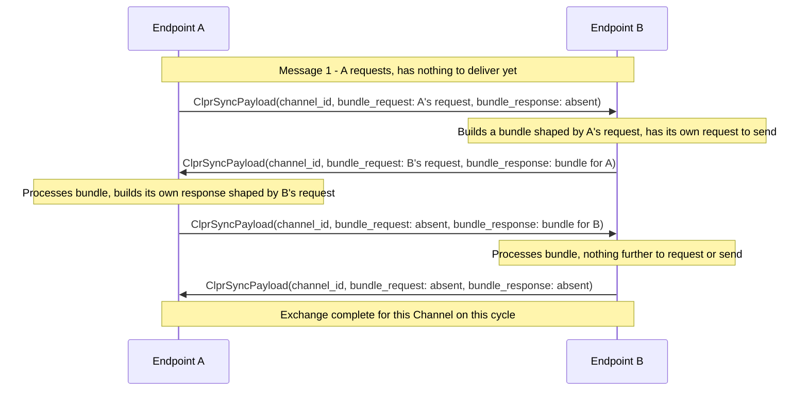

# CLPR Endpoint Sync Streaming Protocol and mTLS Root-of-Trust Model

This document proposes two related changes to the CLPR network layer's endpoint-to-endpoint communication:
(1) replacing the single-call `sync` RPC with a bidirectional-streaming, two-phase request/response protocol that
eliminates the systematic duplicate-send problem in the current spec; and (2) replacing the single RSA leaf
certificate in `ClprEndpointManifest` with a two-tier root-CA / leaf model for mTLS — an ECDSA P-384 root
certifying an Ed25519 leaf. Both changes touch the same protocol surface — the endpoint gRPC service and the data
it carries — so they are addressed together.

Sync cadence (how often an endpoint should attempt a new cycle on a given Channel) is deliberately out of scope.
It was previously removed from the spec and left unspecified on purpose: endpoints determine their own sync
frequency per Channel, and the right cadence to minimize duplicate-send waste while maximizing progress
throughput is an empirical tuning question, not a protocol-level constant.

---

## 1. Problem

### 1.1 The single-call `sync` RPC causes systematic duplicate sends

The current spec (`clpr-service-spec.md` §1.5) defines `sync` as a single unary RPC: `rpc sync(ClprSyncPayload)
returns (ClprSyncPayload)`. The initiator pre-computes its bundle from its locally cached view of the peer's
`acked_message_id` — which reflects the peer's on-chain state as of the *last completed* sync cycle, not the
peer's actual state now. Between cycles, the peer's `received_message_id` has typically advanced (a submitted
bundle reached consensus), but the initiator has no way to learn that before building its next bundle.

Concretely: if endpoint A sends messages `[1,2,3]` in cycle N, endpoint B's `verifyBundle` response in that same
cycle reflects B's pre-commit state (`received_message_id = 0`), so A's `acked_message_id` becomes 0, not 3. In
cycle N+1, A still believes none of `[1,2,3]` were acknowledged and resends them alongside any new messages. The
replay defense (`clpr-service-spec.md` §4.2 Step 3) filters the duplicates, so this is not a correctness bug, but
in steady state it roughly halves effective bundle throughput under `max_messages_per_bundle`. The spec explicitly
flags this as unresolved:

> 📝 **Pending — Metadata Exchange Optimization (target: 1.0).** ... This optimization is not yet specified at the
> wire level; implementations of the current spec MUST use the single-call `sync` form.

The design doc (`clpr-service.md` §3.1.4–§3.1.5) sketches a fix — an optional `exchangeMetadata`/`verifyMetadata`
call preceding `exchangeBundle` — but that fix requires a new verifier method and a new proof format for data
that, as argued in §3.3 below, never needs to be cryptographically proven at all.

### 1.2 The endpoint TLS certificate is oversized for on-chain storage

`ClprEndpoint.tls_certificate` (`clpr-service-spec.md` §1.2) is specified as a DER-encoded RSA certificate,
**presented directly** as the mTLS identity for every gRPC sync connection:

```protobuf
// DER-encoded RSA public certificate used for mTLS between endpoints.
// Minimum RSA key size: 2048 bits. RSA-3072 or higher is RECOMMENDED.
bytes tls_certificate = 2;
```

`ClprEndpointManifest` is on-ledger state, and each Channel caches up to `max_peer_endpoints` entries from it
(`ClprThrottles.max_peer_endpoints`). An RSA-3072+ certificate is large; every byte is multiplied by every cached
copy across every Channel.

This isn't just an algorithm-choice problem, either: X.509 places no upper bound on certificate size at all. A
self-signed certificate with conventional metadata commonly runs over 3KB regardless of key type, and nothing
stops one from being deliberately constructed at 60KB or larger — the current spec has no size ceiling on
`tls_certificate` beyond what's implied by `max_sync_bytes` for the sync payload as a whole. §3.5 and §3.6 address
both halves of this: what a minimal certificate should contain, and a fixed maximum the protocol actually enforces
regardless of what any given endpoint submits.

---

## 2. Options Considered

The chosen design: `sync` becomes a bidirectional gRPC stream, one stream per sync cycle, over an optionally
persistent underlying connection. Each side exchanges an unproven `BundleRequest`
describing its own current queue state, and responds with a `BundleResponse` shaped by the peer's request —
eliminating the duplicate-send problem (§1.1) without any new proof format. For mTLS, `ClprEndpointManifest.tls_certificate`
becomes a self-signed ECDSA P-384 CA certificate with minimized field content (empty DN, minimal serial, no
path-building or revocation extensions), published as the durable trust anchor; each endpoint separately holds an
Ed25519 leaf keypair, generated fresh at process startup, held only in memory, signed by the CA's own key, and
never published. The root certificate MUST NOT exceed 512 bytes, enforced by the CLPR Service at manifest
admission time — a fixed protocol constant, not a per-ledger throttle. Full technical detail is in §3; the
subsections below cover the alternatives that were seriously considered and why they were rejected.

### 2.1 Sync protocol: keep unary `sync`, add proven `exchangeMetadata`/`verifyMetadata` (original design-doc path)

The design doc's existing sketch: a lightweight *state-proven* metadata exchange, verified locally via a new
`verifyMetadata` verifier method, ahead of the bundle exchange. Rejected. The metadata being exchanged (the peer's
current `received_message_id`, `trust_anchor_id`, `endpoint_manifest_version`, `status`) only ever affects *which
messages/proofs the peer chooses to include* in the bundle it builds next — it never needs to authorize a state
change. `verifyBundle`'s replay defense, hash-chain check, and trust-anchor update path (`clpr-service-spec.md` §4.2
Steps 1c, 3, 4) run regardless and are the only things that actually mutate on-chain state. Requiring a
cryptographic proof — and a new verifier interface method every verifier implementation must support — for data
whose worst-case failure mode is "the peer builds a slightly wrong-shaped bundle" is disproportionate to the risk.
The chosen streaming design (§3) carries the same information without any proof at all — see §3.3 for the trust
model that makes this safe.

### 2.2 mTLS root algorithm: RSA vs. ECDSA — chosen ECDSA

Beyond the storage-size argument in §1.2, there is an internal inconsistency in `clpr-hiero`'s own constants worth
correcting rather than reproducing: `CryptoConstants.TLS_SUITE = "TLS_ECDHE_ECDSA_WITH_AES_256_GCM_SHA384"` mandates
ECDSA authentication for the TLS handshake itself, and the agreement (leaf) key is already EC on a P-384 curve
(`AGR_KEY_SIZE_BITS = 384`, `AGR_TYPE = "EC"`). Only the signing (root) key is RSA (`SIG_TYPE1 = "RSA"`,
`SIG_KEY_SIZE_BITS = 3072`). RSA-3072 provides ~128-bit security strength; P-384 provides ~192-bit
([NIST SP 800-57](https://nvlpubs.nist.gov/nistpubs/specialpublications/nist.sp.800-57pt1r5.pdf)). **The root is
currently the weaker link than the leaf it certifies** — backwards for a trust hierarchy, where the root should
never be weaker than what it signs. Moving the CLPR endpoint root to ECDSA fixes both the size problem and this
hierarchy inversion, and does so by adopting the algorithm family the surrounding system (and the TLS cipher suite
it already negotiates) already commits to.

### 2.3 ECDSA curve for the root: secp256k1 vs. P-256 vs. P-384 — chosen P-384

CLPR elsewhere uses ECDSA secp256k1 for Channel/connector registration keys (Ethereum-style), so it was worth
asking whether the same curve should carry through to the TLS layer for consistency. Rejected for TLS specifically:
in the [IANA TLS Supported Groups registry](https://www.iana.org/assignments/tls-parameters/tls-parameters.xml),
secp256k1 holds codepoint 22 but is marked **Recommended: N**, and that codepoint range is not carried forward into
TLS 1.3's negotiable groups at all — only `secp256r1`/`secp384r1`/`secp521r1` and `X25519`/`X448` are. A CLPR root
cert that can't be validated under TLS 1.3 by standard stacks (Java JSSE/SunEC, OpenSSL, Go `crypto/tls`) is a poor
choice for a value that has to interoperate across every ledger's endpoint implementation.

Between the two viable NIST curves: P-256 (~128-bit security, matching RSA-3072's current level) would suffice to
*replace* RSA at equivalent strength, but would reintroduce the root-weaker-than-leaf inversion from §2.2 (P-256 at
128-bit vs. the existing P-384 leaf key strength it certifies). P-384 avoids that inversion and aligns with the
rationale `clpr-hiero`'s own `KeysAndCertsGenerator` doc comment already invokes: "chosen in accordance with the
IAD-NSA Commercial National Security Algorithm (CNSA) Suite." CNSA Suite 1.0 specifically mandates P-384 + SHA-384
for ECDSA ([RFC 9151](https://www.rfc-editor.org/rfc/rfc9151.html)) — the same standard already used to justify the
existing leaf key's curve choice. **Chosen: P-384 for the root**, keeping the hierarchy correct (root ≥ leaf) and
staying inside the security framework this codebase already claims to follow. The leaf's own algorithm is a
separate decision — see §2.4.

### 2.4 Leaf algorithm: match the root (ECDSA P-384) vs. EdDSA — chosen EdDSA

The root and the leaf have different requirement profiles, and nothing requires them to share an algorithm. The
root is published on-chain, needs to align with `clpr-hiero`'s existing CNSA-cited convention, and needs the most
mature available cross-ecosystem and FIPS-validated-module support, since every future verifier implementation has
to parse it. It's also invoked rarely — only to sign an occasional leaf.

The leaf is the opposite profile: never published anywhere, generated fresh at every process start, and — critically
— it performs the highest-frequency signing operation in the entire system, a fresh `CertificateVerify` signature
on every single TLS handshake for the life of the process. That is exactly the scenario where ECDSA's dependence on
a correctly-generated random nonce per signature matters most: a flawed, biased, or reused nonce leaks the private
key from as few as two signatures (the Sony PS3 signing-key leak is the canonical real-world instance of this
failure class). EdDSA (Ed25519/Ed448) removes that failure mode entirely by deriving the signing nonce
deterministically from the message and the key, rather than depending on a fresh random value every time.

Being unpublished exempts the leaf from the root's CNSA/FIPS-alignment requirement, but it does not exempt it from
interoperability: the leaf certificate still crosses the wire in every handshake, so any CLPR endpoint
implementation on the receiving end — not just `clpr-hiero`'s JVM stack — must be able to validate it. EdDSA clears
this bar today: it's standardized for X.509 (RFC 8410) and for TLS 1.3 signature schemes (RFC 8446), and supported
broadly (OpenSSL 1.1.1+, Go `crypto/tls`, JDK 15+, BoringSSL). JDK 15+ specifically supports EdDSA certificates for
TLS client/server authentication under both TLS 1.2 and TLS 1.3 (`X509KeyManager`/`X509ExtendedKeyManager` accept
`"EdDSA"` as a `keyType`; `SignatureScheme` supports `ed25519`/`ed448` in both protocol versions) — relevant since
`clpr-hiero`'s `CryptoConstants.SSL_VERSION` is currently pinned to `"TLSv1.2"`.

A root signed with one algorithm certifying a leaf that holds a different algorithm's key is a standard X.509/TLS
construction, not a special case: the issuer's signature over the leaf certificate always uses the issuer's own
key, independent of what key type the leaf's `SubjectPublicKeyInfo` carries. TLS 1.3 separates these concerns
explicitly via the `signature_algorithms` (handshake signatures) and `signature_algorithms_cert` (certificate-chain
signatures) extensions — see §3.4 for how `clpr-hiero` already does exactly this. **Chosen: root stays ECDSA
P-384; leaf moves to EdDSA.**

### 2.5 EdDSA variant for the leaf: Ed25519 vs. Ed448 — chosen Ed25519

The root-must-never-be-weaker-than-the-leaf argument (§2.3) doesn't run in reverse. It holds for the root because a
broken root can forge arbitrary new leaves — the root is the single point whose compromise cascades. A broken leaf
compromises only that one leaf, and recovery is local and free (§3.4): generate a new one, no coordination with any
peer required. There is no cascade to protect against by over-provisioning the leaf's strength to match the root's
~192-bit margin. Ed25519's ~128-bit security is more than sufficient for a credential whose worst-case outcome is
"replace it, no coordination needed." Ed448 (~224-bit) would just be spending extra computation on a low-value,
easily-replaced asset for no corresponding reduction in risk. **Chosen: Ed25519.**

---

## 3. Proposed Solution

### 3.1 Wire protocol: bidirectional streaming

```protobuf
service ClprEndpointService {
  // Bidirectional sync: exchange a stream of ClprSyncPayload messages with a
  // peer endpoint, scoped to a single Channel. channel_id ties each
  // message to the on-chain Channel it belongs to. See the message
  // sequence below.
  rpc sync(stream ClprSyncPayload) returns (stream ClprSyncPayload);
}
```

A representative sequence for one Channel:



The terminal message (both fields absent) closes the stream. One stream is one sync cycle on a Channel; the
underlying gRPC connection and its TLS session may stay open, and the next sync cycle opens a new stream on that same
connection — no additional handshake. Sync cadence is intentionally left to endpoint implementations (see the note
at the top of this document).

### 3.2 `bundle_request` fields — validated against the Bundle Progress Criteria

All four fields indicate the current remote chain state to inform bundle creation:

```protobuf
// Unproven request describing the sender's own current Channel state,
// used by the recipient to shape a minimal, progress-making bundle in a
// later BundleResponse on this stream. See §3.3 for the trust model — none
// of this is state-proven and none of it may cause a state change.
message BundleRequest {
  // The sender's current Channel.received_message_id. The recipient
  // computes the start of its message range as
  // (current_received_message_id + 1) — the +1 is the recipient's
  // computation, not carried in the field, so the field always reflects an
  // actual queue position rather than a derived one.
  uint64 current_received_message_id = 1;

  // The sender's current Channel.status.
  ClprChannelStatus current_status = 2;

  // The sender's current Channel.trust_anchor_id.
  bytes current_trust_anchor_id = 3;

  // The sender's current Channel.endpoint_manifest_version.
  uint64 current_endpoint_manifest_version = 4;
}
```

Each field maps to a specific Bundle Progress Criterion (`clpr-service-spec.md` §2.1.2) that the recipient needs
fresh (not one-cycle-stale) information about in order to build a bundle that actually makes progress:

| Field | Progress Criterion it serves | Why the recipient needs it |
|---|---|---|
| `current_received_message_id` | 1 — New messages | Start of the message range to include; stale values are exactly today's duplicate-send problem (§1.1). |
| `current_trust_anchor_id` | 2 — Trust anchor advancement | Lets the recipient decide, per the endpoint's per-channel trust-anchor obligation (`clpr-service-spec.md` §3.2), whether a transition bundle must precede or replace a normal application bundle — without waiting a full cycle to discover this via stale `ClprQueueMetadata`. |
| `current_status` | 4 — Channel state transition | Lets the recipient skip bundle construction entirely when the sender is already `CLOSED` (guaranteed rejection) or shape a close-notification appropriately when the sender is `DRAINED`/`CLOSING`. |
| `current_endpoint_manifest_version` | 5 — Endpoint manifest advancement | Lets the recipient decide whether to embed a manifest-update proof. |

**Criterion 3 (acknowledgement progress) needs no dedicated field.** It's a byproduct of the state-proven
`ClprQueueMetadata.received_message_id` that's mandatory in every real `BundleResponse` — the recipient doesn't
need the sender's help to shape *that*; it just happens whenever a bundle is actually sent. No field is missing:
all five Bundle Progress Criteria are covered — four directly by `BundleRequest` fields, one automatically by the
bundle response's own state-proven metadata.

### 3.3 Trust model for the unproven request

`BundleRequest` is deliberately **not** state-proven, and must never be treated as if it were:

- If a peer *under*-claims `current_received_message_id` (reports less than it actually received), the recipient
  builds a bundle with some redundant messages — caught and discarded by replay defense (`clpr-service-spec.md` §4.2
  Step 3), exactly
  today's harmless-but-wasteful failure mode.
- If a peer *over*-claims `current_received_message_id` (reports more than it actually received), the recipient
  may skip messages the peer still needs — a liveness risk only; permissionless resubmission
  (`clpr-service-spec.md` §2.4.2) still delivers the skipped range later. **If
  `current_received_message_id >= Channel.next_message_id`** (`clpr-service-spec.md` §2.1), the claim names a
  message that doesn't exist yet; the recipient MUST fall back to `acked_message_id + 1` as the range start. No
  other over-claim is defended against — it's indistinguishable from the recipient's own stale view of the peer,
  and only harms the over-claiming peer.

This is the reason `verifyMetadata` (§2.1) is unnecessary: nothing in this exchange needs to survive a Byzantine
peer with better-than-liveness guarantees, because the real correctness backstops (`verifyBundle`'s replay defense,
hash-chain check, and trust-anchor update) are untouched by this handshake and still run on every actual bundle
submission.

### 3.4 mTLS root-of-trust model

`ClprEndpointManifest.tls_certificate` becomes an ECDSA P-384 X.509 **CA certificate** — self-signed,
`basicConstraints: CA:TRUE`, `keyUsage: keyCertSign, cRLSign`. Each endpoint separately holds a leaf
keypair/certificate — Ed25519, signed by the CA's P-384 private key, `basicConstraints: CA:FALSE`,
`keyUsage: digitalSignature` (EdDSA keys are signature-only and carry no `keyAgreement` usage) — presented at the
actual mTLS handshake for every gRPC connection. See §2.4–2.5 for why the leaf's algorithm differs from the root's.

The leaf is generated when the endpoint process starts, held only in memory, never persisted, and never published
in `ClprEndpointManifest`. It regenerates on process restart and, independently, whenever its forced expiration
interval (below) elapses.

The forced expiration interval, `leaf_certificate_validity_seconds`, is local endpoint configuration — not
on-chain state or a wire field. It's baked into the leaf certificate's `notAfter` at generation time, so an
expired leaf is invalid regardless of whether the generating process is still running. On expiration, the
endpoint generates a fresh leaf, signed by the same CA, before the next mTLS handshake; rotation happens between
sync attempts, never mid-stream, with no peer coordination required. `0` disables expiration (matching today's
`clpr-hiero` gossip TLS precedent — see below); the default if unspecified is `86400` (24 hours). The interval is
otherwise left to each operator's security posture, the same way sync cadence is left unspecified.

This two-tier shape, including the mixed-algorithm chain, is not a novel pattern for this codebase: `clpr-hiero`'s
existing gossip TLS already does exactly this. `KeysAndCertsGenerator.generate()` produces two certificates per
node — a self-signed **signing** cert (root of trust, published in the consensus roster — see
`RosterUtils.fetchGossipCaCertificate`, literally named as a CA lookup) and an **agreement** cert, signed by the
signing key, used for the actual TLS socket (`TlsFactory`'s `agrCert`/`agrKey` constructor arguments). The
agreement cert's `SubjectPublicKeyInfo` is already EC even though it's signed with the signing key's own RSA
algorithm (`schema.getSigningAlgorithm()`, passed the RSA `sigKeyPair` as signer) — the same mixed-algorithm-chain
shape this design uses for its ECDSA-root/EdDSA-leaf split.

### 3.5 Certificate field minimization

The root certificate serves exactly one purpose: acting as the trust anchor a peer already possesses via
`ClprEndpointManifest`, validated by direct comparison. It is never checked against a public trust store, never
discovered via generic multi-CA path-building, never subject to revocation lookup (no CRL/OCSP is specified
anywhere in this design), and never browsed by a human or unrelated tooling. Every X.509 convention that exists to
serve one of *those* purposes is dead weight here and MUST be omitted rather than included by default:

- **Issuer/Subject Name (DN)**: minimal. A populated DN (`C=`, `ST=`, `L=`, `O=`, `CN=`, etc.) exists so a human or a
  generic certificate-management tool can identify whose certificate it's looking at when browsing a store of many
  unrelated certificates. That never happens here — the manifest already tells the validating peer exactly which
  certificate to expect. Some X.509 implementations (notably Java's built-in certificate path validation) reject a
  certificate whose Issuer or Subject is a completely empty SEQUENCE, so an empty DN cannot be required. A minimal
  entry MUST be provided; content beyond what the implementation requires SHOULD be omitted. If no implementation
  constraint applies, `CN=CLPR` serves as a suitable minimal value. Measured cost of a fully populated DN versus a
  single minimal RDN, holding everything else constant: roughly 145 bytes.
- **Serial number**: minimal (e.g., `1`). Large random serials exist to guarantee collision resistance across a
  shared public namespace — CA/Browser Forum Baseline Requirements mandate ≥64 bits of entropy specifically for
  publicly-trusted certificates. This certificate never enters a shared namespace with any other CA.
- **`subjectKeyIdentifier` / `authorityKeyIdentifier`**: omit. These exist so generic path-building software can
  pick the right issuer out of many candidate CAs when constructing a chain. There is exactly one candidate here —
  no path to build.
- **`subjectAltName`, `certificatePolicies`, CRL distribution points, authority info access / OCSP,
  `extendedKeyUsage`**: omit. None of the purposes these serve exist in this design: network address travels in a
  separate manifest field (`ClprEndpoint.service_endpoint`), not the certificate; there is no revocation-checking
  mechanism; and the certificate is used for nothing beyond CLPR endpoint mTLS.
- **`basicConstraints` (`CA:TRUE`) and `keyUsage` (`keyCertSign`, `cRLSign`)**: keep. These are the exception —
  small (~30 bytes combined), and they're what lets a peer's *standard* PKIX validation logic, not just
  CLPR-specific code, correctly recognize this certificate as authorized to sign a leaf. That's real
  interoperability value across every CLPR endpoint implementation, not a convention serving some purpose this
  certificate doesn't have.

Measured impact (ECDSA P-384, otherwise identical): a conventionally-populated certificate — real DN, default-tooling
`subjectKeyIdentifier`/`authorityKeyIdentifier`, `basicConstraints` — runs ~565–580 bytes. The same certificate with
an empty DN, no key identifiers, and only `basicConstraints`+`keyUsage` retained runs ~370 bytes: roughly a 35%
reduction on top of whatever the RSA→ECDSA switch (§2.2) already saved, without touching the algorithm or curve
decision at all. `clpr-hiero`'s own `CertificateUtils.generateCertificate()` already produces this minimal shape
today — its current code adds zero explicit extensions — so the only *addition* this ADR proposes on top of that
existing precedent is `basicConstraints`+`keyUsage`, deliberately, for the interoperability reason above.

EC point compression (P-384's point drops from 97 bytes uncompressed to 49 compressed) is a further, larger lever,
but it isn't automatic: certificate-building tooling doesn't reliably propagate a compressed-point encoding into
the final `SubjectPublicKeyInfo` even when the underlying key material is generated in compressed form — this needs
explicit support at the certificate-construction layer to realize. Worth pursuing once the specific library doing
the cert construction is confirmed to support it; not assumed here.

### 3.6 Certificate size enforcement

Recommending minimal field content (§3.5) isn't sufficient on its own. X.509 places no upper bound on certificate
size — a cert built with default tooling and no thought given to §3.5 lands around 565–580 bytes (measured above),
and a cert deliberately padded with garbage extension data can run to tens of kilobytes or more without becoming
invalid. Whatever ends up in `ClprEndpointManifest.tls_certificate` is on-ledger state, cached across every
Channel's `max_peer_endpoints` copies — an unbounded field size is an unbounded on-chain storage and DoS
exposure regardless of how small a well-behaved cert could be.

**A CLPR Service MUST reject any `ClprEndpoint.tls_certificate` larger than 512 bytes when it is admitted to
`ClprEndpointManifest`** — via `registerEndpoint`, `addEndpoint`, or `updateEndpointManifest`
(`clpr-service-spec.md` §6.5) on permissionless platforms, or via the equivalent internal check a platform-managed
implementation applies when constructing the manifest (e.g., Hiero's roster-mirroring, `clpr-service.md` §3.1.2).
This is a fixed protocol-level constant, not a `ClprThrottles` field: unlike the other throttles, which legitimately
vary by ledger because they're tied to real per-ledger capacity (gas, block size, bandwidth), there's no legitimate
reason one ledger would want a materially different ceiling here — making it configurable would let a permissive or
complicit ledger simply set its own value high enough to defeat the check.

512 bytes is chosen against two anchors, not picked arbitrarily: it sits comfortably above the ~370-byte cert §3.5
recommends (margin for legitimate implementation variance — a fallback minimal `CN` in place of an empty DN, minor
DER encoding differences) while sitting below the ~565–580 byte cost of a conventionally-generated cert that didn't
bother with §3.5's guidance. That second property is the point: the limit has to actually reject the "used default
tooling, didn't omit anything" case, not just the pathological one, or the `MUST omit unnecessary data` requirement
in §3.5 has nothing enforcing it.

---

## 4. Code Artifacts

### 4.1 `ClprSyncPayload` — restructure for streaming (`clpr-service-spec.md` §1.5)

```protobuf
// One message in the bidirectional sync stream, which is scoped to a
// single Channel (§3.1).
message ClprSyncPayload {
  // Channel ID identifying the Channel this message belongs to.
  // MUST be exactly 32 bytes.
  bytes channel_id = 1;

  // A request for a bundle. Unproven — see §3.3 (this ADR) for the trust
  // model. Absent when the sender has no further request for this
  // Channel in this cycle.
  BundleRequest bundle_request = 2;

  // A response to a previously received BundleRequest. Absent when this
  // message carries no bundle for this Channel in this cycle.
  BundleResponse bundle_response = 3;
}

// See §3.2 (this ADR) for the full field-by-field rationale.
message BundleRequest {
  uint64 current_received_message_id = 1;
  ClprChannelStatus current_status = 2;
  bytes current_trust_anchor_id = 3;
  uint64 current_endpoint_manifest_version = 4;
}

message BundleResponse {
  // Opaque payload for the receiving ledger's verifier contract. Contains
  // the state proof, the message data it attests to, and whatever else
  // the verifier needs to extract and verify queue metadata and messages.
  bytes bundle_payload = 1;
}
```

### 4.2 `enum ClprChannelStatus` — formalize (new, `clpr-service-spec.md` §1.5)

Referenced by name in `ClprQueueMetadata.status` today but never given a standalone protobuf definition — only the
prose `Channel.status` enum (`clpr-service-spec.md` §2.1) lists its values. `BundleRequest.current_status` needs
the same type, so this ADR formalizes it:

```protobuf
enum ClprChannelStatus {
  PENDING = 0;
  ACTIVE = 1;
  PAUSED = 2;
  CLOSING = 3;
  DRAINED = 4;
  CLOSED = 5;
}
```

`ClprQueueMetadata.status` (`clpr-service-spec.md` §1.5) and `Channel.status` (`clpr-service-spec.md` §2.1) both
become typed references to this enum instead of an inline/prose enum.

### 4.3 `ClprEndpointService` — streaming `sync` (`clpr-service-spec.md` §1.5)

```protobuf
service ClprEndpointService {
  rpc sync(stream ClprSyncPayload) returns (stream ClprSyncPayload);
}
```

Replaces the current unary `rpc sync(ClprSyncPayload) returns (ClprSyncPayload)`.

### 4.4 `ClprEndpoint.tls_certificate` — CA-cert semantics (`clpr-service-spec.md` §1.2)

```protobuf
message ClprEndpoint {
  ServiceEndpoint service_endpoint = 1;

  // DER-encoded ECDSA X.509 CA certificate (curve P-384; self-signed;
  // basicConstraints CA:TRUE; keyUsage keyCertSign, cRLSign; minimal
  // issuer/subject DN (e.g. CN=CLPR); minimal serial number; no subjectKeyIdentifier,
  // authorityKeyIdentifier, or other path-building/revocation extensions
  // — see §3.5 for the full field-minimization rationale). MUST NOT
  // exceed 512 bytes; the CLPR Service MUST reject admission of a
  // ClprEndpoint whose tls_certificate exceeds this size (§3.6). This is
  // a root of trust, not a certificate presented directly on the wire:
  // each endpoint separately holds a leaf keypair/certificate signed by
  // this CA's private key, and presents the leaf at the actual mTLS
  // handshake. 
  bytes tls_certificate = 2;
}
```

### 4.5 Retire pending callouts (`clpr-service-spec.md` §1.5, §3.1; `clpr-service.md` §3.1.4, §3.1.5)

- Remove the "📝 Pending — Metadata Exchange Optimization (target: 1.0)" callout in `clpr-service-spec.md` §1.5 —
  superseded by §3.1–3.3 of this ADR.
- Remove the "📝 Pending — `verifyMetadata` (target: 1.0)" callout in `clpr-service-spec.md` §3.1 — no longer
  needed; see §3.3 of this ADR for why the hint stays unproven.
- Rewrite `clpr-service.md` §3.1.4 ("Endpoint Communication Protocol") prose and mermaid diagram to describe the
  streaming handshake instead of the optional `exchangeMetadata`/required `exchangeBundle` two-call model.
- Remove the `verifyMetadata` bullet from `clpr-service.md` §3.1.5 ("Verifier Contracts").

---

## 5. Changes to Existing Specification Files

### `clpr-service-spec.md`

| Section | Change |
|---|---|
| §1.2 `ClprEndpoint` | Rewrite `tls_certificate` comment for CA-cert semantics, ECDSA P-384, field-minimization guidance (empty DN, minimal serial, no path-building/revocation extensions), and the 512-byte MUST-reject ceiling (§4.4). |
| §1.5 `ClprSyncPayload` | Restructure: replace `bundle_payload: bytes` with `bundle_request: BundleRequest` field 2 and `bundle_response: BundleResponse` field 3 (§4.1). |
| §1.5 (new) `BundleRequest` | New message, per §4.1. |
| §1.5 (new) `BundleResponse` | New message wrapping `bundle_payload`, per §4.1. |
| §1.5 (new) `enum ClprChannelStatus` | New formal enum definition, per §4.2; update `ClprQueueMetadata.status` to reference it. |
| §1.5 `ClprEndpointService` | `sync` becomes bidirectional streaming (§4.3). Remove the Metadata Exchange Optimization pending callout. |
| §2.1 `Channel.status` | Reference `ClprChannelStatus` enum instead of inline prose enum. |
| §3.1 `IClprVerifier` | Remove the `verifyMetadata` pending callout. |
| §6.5 `registerEndpoint`/`addEndpoint`/`updateEndpointManifest` | Add: MUST reject admission of any `ClprEndpoint` whose `tls_certificate` exceeds 512 bytes (§3.6 this ADR). |

### `clpr-service.md`

| Section | Change |
|---|---|
| §3.1.2 Endpoint Manifest | Update "TLS Certificate" bullet: CA-cert semantics, ECDSA P-384 root with minimized field content and a 512-byte ceiling (§3.5–3.6 this ADR); in-memory Ed25519 leaf-cert model (generated at startup, never published, rotated in-process on a locally-configured forced-expiration interval). |
| §3.1.2 Endpoint Manifest, Hiero callout | Note that the 512-byte ceiling applies equally to certificates admitted via roster-mirroring, not only via the permissionless `registerEndpoint`/`addEndpoint` path. |
| §3.1.4 Endpoint Communication Protocol | Replace `exchangeMetadata`/`exchangeBundle` two-call description and mermaid diagram with the streaming handshake (§3.1 this ADR). |
| §3.1.5 Verifier Contracts | Remove `verifyMetadata` bullet and its associated prose. |


