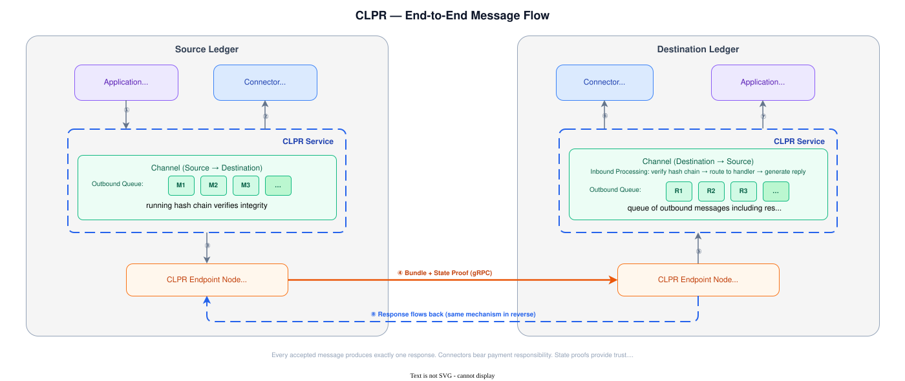
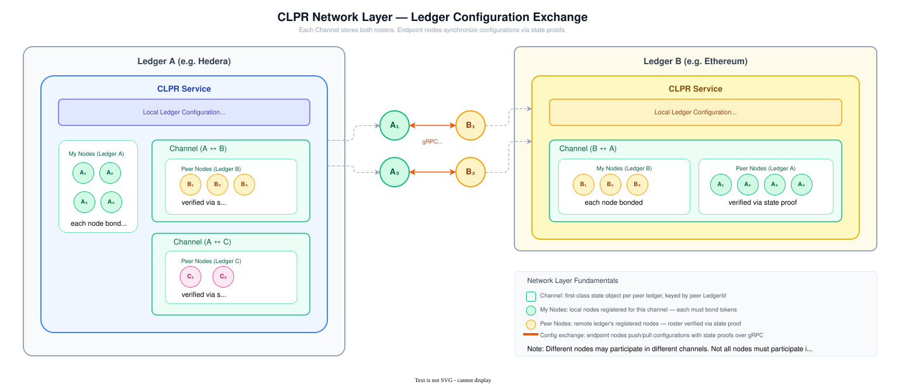
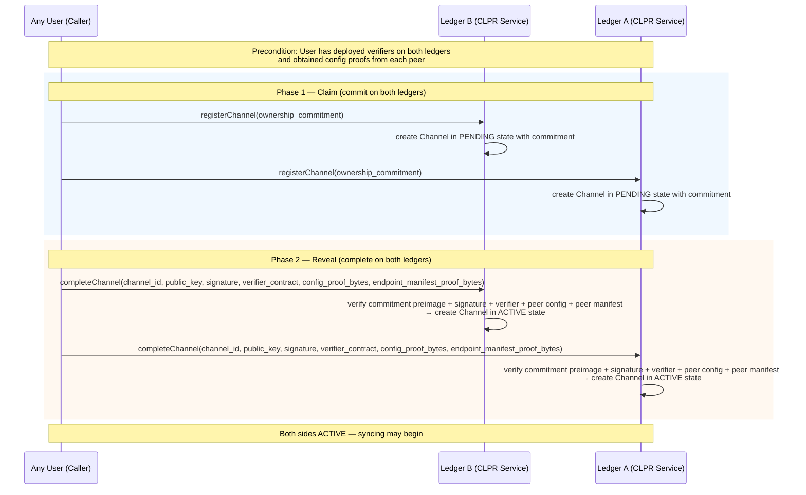
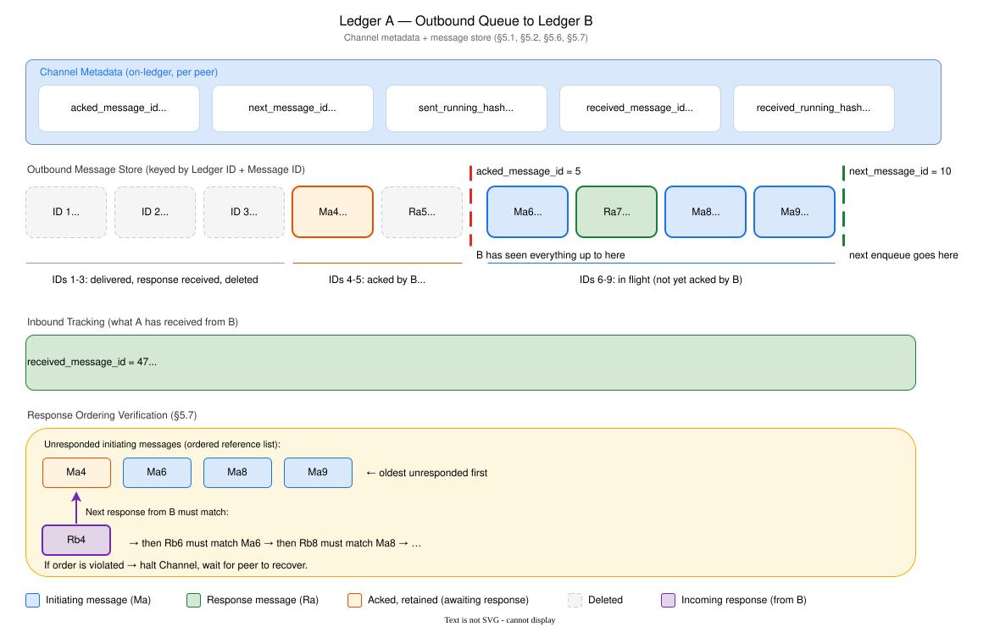
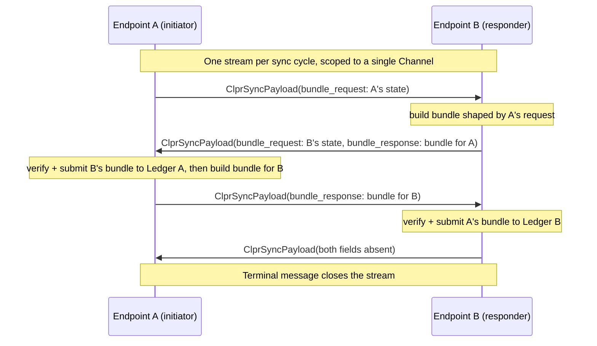
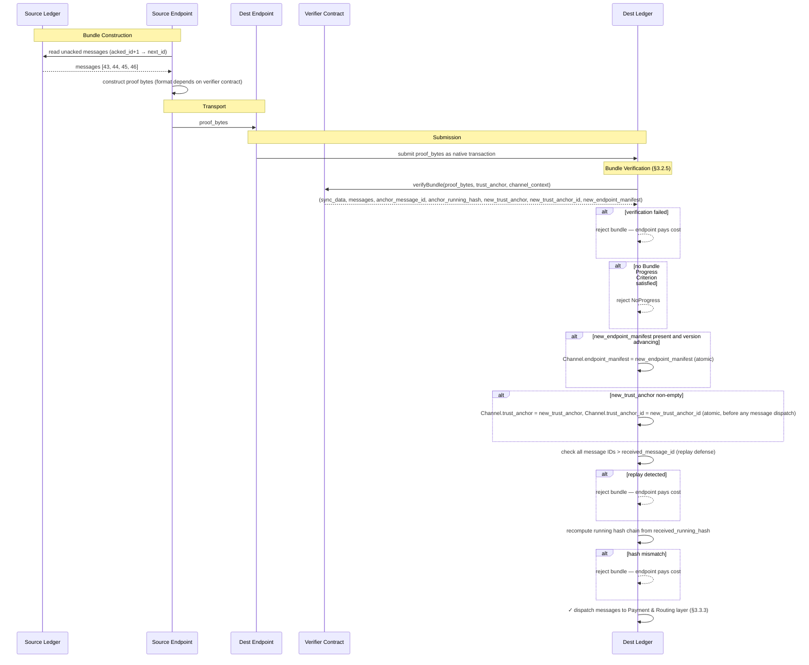
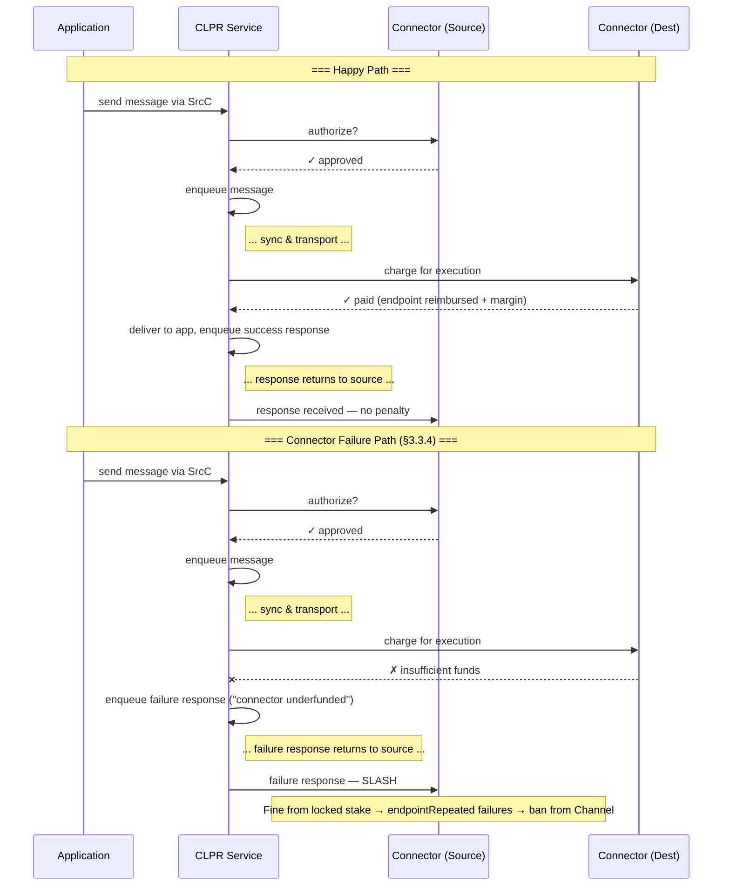

# 1. Executive Summary

CLPR (pronounced "Clipper") is a **Cross Ledger Protocol** that enables reliable, asynchronous message passing between
independent ledger networks. Unlike existing interledger solutions that weaken trust by introducing intermediary
consensus layers or federated bridges, CLPR relies on each ledger's native finality guarantees and verifiable state
proofs to achieve direct, ledger-to-ledger communication.

Messages are arbitrary byte payloads, making CLPR a general transport primitive suitable for cross-ledger smart contract
invocation, token movement, oracle data propagation, or application-specific messaging. When both participating ledgers
provide ABFT finality, CLPR inherits those guarantees and requires only a single honest endpoint node per ledger for
correct operation.

CLPR introduces no new token. All incentives and penalties are denominated in native ledger tokens and mediated through
**Connectors** — economic actors who front payment for message execution and are subject to slashing for misbehavior.

## Why CLPR

- **Preserves ABFT guarantees** — if both networks are ABFT, interledger communication inherits ABFT properties.
- **Eliminates intermediary trust** — ledgers rely on each other's verifiable state proofs rather than bridge
  validators.
- **Improves on existing solutions** — faster, cheaper, and/or more reliable than current interledger protocols.
- **Supports hybrid topologies** — enables communication between public and private Hiero networks and cross-ledger
  application orchestration.
- **Unlocks new business use cases** — enables new categories of cross-chain applications and financial workflows not possible with existing interledger approaches.

---

# 2. Core Concepts and Terminology

CLPR connects one ledger to another without any intermediary nodes or networks. In a very real sense, *the ledgers are
communicating directly*. Users only have to trust the two ledgers they send messages between.

> 💡 **A note on Hedera and Hiero:** Throughout this document, "Hiero" refers to the open-source ledger software stack
> (the node software, its APIs, and its state model). "Hedera" refers to the specific public network that runs Hiero. When
> describing behavior that applies to any network running Hiero (including private deployments), this document uses
> "Hiero." When describing the public mainnet specifically, it uses "Hedera."

## 2.1 Common Terminology

- **Peer Ledger** — The "other" ledger this ledger is communicating with.
- **State Proof** — A cryptographic proof that a specific piece of data exists in a ledger's committed state and/or
  history. State proofs are the mechanism of trust — they allow one ledger to verify claims about another ledger's state
  without trusting any intermediary.
- **Endpoint** — A node responsible for periodically communicating with peer ledger endpoints to exchange configurations
  and messages.
- **CLPR Service** — The core business logic and state implementing CLPR on a particular ledger.
- **Channel** — An on-ledger entity representing a communication channel with a specific peer. Multiple Channels
  may exist between the same pair of ledgers.
- **Connector** — An economic entity that authorizes messages on the source ledger and pays for their execution on the
  destination ledger.
- **Message** — An arbitrary byte payload plus metadata representing a single unit of communication from one ledger to
  another.
- **Bundle** — An ordered batch of messages transmitted together between two ledgers, accompanied by a state proof.
- **Data Message** — A message carrying application-level content from one ledger to another. This is the primary unit
  of cross-ledger communication
- **Response Message** — A special message generated on the destination ledger and sent back to the source ledger,
  indicating success or a specific failure condition. Every Data Message produces exactly one Response Message in order.
- **Control Message** — A protocol-level message that manages the state of a Channel rather than carrying application
  data. Configuration updates are delivered as Control Messages.
- **Source Ledger / Destination Ledger** — The originating and receiving ledgers for a given message, respectively.
- **Configuration** — The chain ID and other metadata describing a ledger participating in CLPR.
- **HashSphere** — A private or permissioned network running Hiero software, typically deployed for enterprise or
  regulated use cases.

## 2.2 High-Level Message Flow

A good way to think about CLPR is by considering a simple message flow. In this flow, an application on the **source**
ledger will **initiate** a message transfer to a **destination** ledger. On the source ledger the application will call
the **CLPR Service** (which may be a native service on Hiero, or a smart contract on EVM-based or other ledgers). This
service maintains a queue of outgoing messages, and some information about which messages have been **acknowledged** as
having been received by the destination ledger.



Before adding a message to the end of the queue, the service will call a **connector** (chosen by the application) to
ask it whether it will be willing to facilitate payment on the destination ledger for this message. Connectors
represent economic actors. A connector has a presence on both the source and destination ledger. The connector on the
source is literally saying, "I am willing to pay for delivery and handling of this message on the destination ledger."
If the connector is willing, then the message is added to the outbound queue on the source ledger.

Once in the queue, **endpoints** on either the source or destination ledger initiate a connection with a peer endpoint.
When they do, they exchange a **bundle** of messages that have *not yet* been confirmed as received by the other ledger.
Among these messages are **responses** to formerly sent messages, along with **state proofs** to prove everything they
communicate with each other. It is through these proofs that cryptographic trust is established.

The endpoint on the destination that receives this bundle constructs a transaction native to its ledger (e.g., a HAPI
`Transaction` on Hiero or an RLP-encoded transaction on Ethereum) and submits the bundle, sync data, and proofs to its
ledger. Post-consensus, the transaction is handled by the CLPR Service on the destination. For each message, it checks
to make sure the connector exists and is able to pay. If so, it sets a max-gas limit and calls the application on the
destination. When this call returns, the connector is debited to pay for the gas used along with a small tax to be paid
to the destination node that submitted the transaction. A **response** message is created and queued to send back to the
source ledger.

On a subsequent **sync** between the source and destination, messages are exchanged, and the source sees the response
message. It records that this message has been received by updating the source ledger state. It then delivers the
response to the source application, and the entire message flow has completed.

Subsequent sections will dive into the details of how this is accomplished, including implementation notes for Hiero and
Ethereum networks, and security measures to prevent various attacks and misuses of CLPR.

## 2.3 Trust Model

An application using CLPR implicitly trusts a chain of components. Understanding this chain is essential for evaluating
whether a particular Channel is safe to use.

**The trust chain.** When an application on Ledger A sends a message through CLPR to an application on Ledger B, it
trusts:

1. **Its own ledger's consensus** — that Ledger A correctly orders and finalizes its transactions.
2. **The local CLPR Service** — that the CLPR Service implementation on Ledger A is correct and faithfully executes the
   protocol (enqueuing messages, processing bundles, enforcing ordering).
3. **The Channel and its verifier** — that the verifier contract on the Channel correctly validates proofs from
   Ledger B. A buggy or compromised verifier could accept fabricated proofs, causing the local ledger to process
   messages that Ledger B never sent.
4. **The remote ledger's consensus and CLPR Service** — that Ledger B correctly orders its transactions and that its
   CLPR Service faithfully executes the protocol.
5. **The remote application** — that the application on Ledger B behaves as expected when it receives the message and
   generates a response.

Most commonly, the same team deploys the application on both ledgers, so trust in the remote application is inherent.
When communicating with a third-party remote application, the usual smart contract audit and trust considerations apply.

**Permissionless channels.** Channel creation is permissionless — anyone can deploy a verifier contract and
register a Channel. This means a Channel's trustworthiness depends entirely on the verifier contract it uses.
Applications (or their users) must independently verify that the Channel they use is backed by a verifier that
correctly validates proofs from the intended peer ledger. A Channel existing on a ledger does not mean the peer is
legitimate or the verifier is honest.

**Connectors.** Connectors are economic actors that front payment for message execution on the destination ledger. An
application chooses which Connector to use. A malicious Connector cannot forge or tamper with messages — the protocol's
state proofs prevent this — but it could refuse to pay, causing messages to fail on the destination. Applications should
choose Connectors with adequate funding and a track record of reliability.

**Endpoint availability.** The protocol's state proofs ensure that even with dishonest endpoints, no fabricated
messages can be accepted — but *availability* depends on at least one honest endpoint per side relaying bundles. If all
endpoints on one side are compromised, messages will be delayed or stalled but never forged.

## 2.4 Participant Roles

Every action in CLPR is ultimately initiated by a human or organization or agent acting in one of six roles.
Understanding these roles — and the trust chain that connects them — is essential for evaluating the security,
economics, and operational viability of a CLPR deployment. This section introduces the roles at a high level; detailed
operational procedures, actions, and risks for each role are described in [§4](#4-roles-and-operations).

### Trust Chain

CLPR's security model is a chain of vetting decisions. Each role evaluates the role below it before committing
economic value or user trust. The chain runs from the End User at the top (who bears the ultimate risk of a failed
cross-ledger interaction) to the Verifier Developer at the bottom (whose code is the cryptographic foundation of
every Channel).

```
End User
  └─ vets → Application Developer (application correctness, choice of Channel and Connector)
       └─ vets → Connector Operator (funding adequacy, reliability, choice of Channel)
            └─ vets → Channel (verifier contract correctness, peer ledger legitimacy)
                 └─ built by → Verifier Developer (proof system implementation)
                      └─ vets → Distributed Ledger (proof system and cryptography)
```

Orthogonally, two infrastructure roles support the entire system:

- **CLPR Service Admin** — emergency authority over all Channels on a CLPR Service instance. Can close
  any Channel but has no role in selecting verifiers, Connectors, or applications.
- **Endpoint Operator** — runs the infrastructure that moves bundles between ledgers. Serves all Channels
  on the ledger without choosing which ones.

**Economic participation is the primary motivator for trust verification.** Connector Operators evaluate verifiers
because their locked stake is at risk if the verifier is compromised. Application Developers evaluate Connectors
because their users' assets depend on reliable message delivery. End Users evaluate applications because their
funds are on the line. At every layer, the party with economic exposure performs the vetting — and the party
without economic exposure (notably the CLPR Service Admin) has the weakest incentive to actively monitor.

### Role Summary

|           Role            |                                         Description                                         |                                    Trust Responsibility                                     |                                            Economic Participation                                             |
|---------------------------|---------------------------------------------------------------------------------------------|---------------------------------------------------------------------------------------------|---------------------------------------------------------------------------------------------------------------|
| **End User**              | Uses applications built on CLPR                                                             | Vets the application and its choices before use                                             | Bears application-level risk (locked assets, failed transactions)                                             |
| **Application Developer** | Builds and deploys cross-ledger applications on both ledgers                                | Vets Channels and Connectors before integrating                                          | Pays per-message fees to Connectors                                                                           |
| **Connector Operator**    | Funds and operates a Connector on one or more Channels; may also create Channels      | Vets verifier implementations before bonding to a Channel                                | Primary economic facilitator — posts balance and locked stake, pays for remote execution, subject to slashing |
| **Verifier Developer**    | Builds, audits, and publishes verifier contract implementations for a specific proof system | Responsible for the correctness and security of the verification logic                      | None in-protocol — compensated externally                                                                     |
| **Endpoint Operator**     | Runs a node that syncs with peer endpoints and submits bundles                              | Trusts the local CLPR Service implementation and the Channels it serves                  | Earns margin from Connector reimbursement; fronts transaction costs                                           |
| **CLPR Service Admin**    | Governs a CLPR Service instance                                                             | Emergency authority — acts when Channels are compromised or the protocol is under attack | None — no fees, no revenue, no bond                                                                           |

### Role Descriptions

**End User.** The person or entity that interacts with applications built on CLPR. They do not interact with the
CLPR protocol directly — they use a cross-ledger application (an asset transfer service, a cross-chain DEX) that
uses CLPR as its transport layer. End Users are permissionless and need only an account on at least one of the
ledgers involved.

**Application Developer.** Builds and deploys smart contracts on both ledgers that use CLPR as a transport layer.
They are the primary consumer of the CLPR protocol — choosing which Channels and Connectors to integrate with,
designing the message format, handling responses, and building the user-facing interface. Application Developers
are permissionless.

**Connector Operator.** The primary economic facilitator — the role with the most direct protocol-level financial
exposure. They register a Connector on a Channel, post a balance and a locked stake, and authorize messages from
applications. Connector Operators are the natural party to create Channels because their locked stake is directly
at risk if the verifier is compromised.

**Verifier Developer.** Builds, audits, and publishes verifier contract implementations for a specific proof system.
They are an entirely off-chain role with no protocol-level identity and no direct economic participation. Yet they
are arguably the most trust-critical role: every Channel depends on a verifier, and every verifier was built by
someone.

**Endpoint Operator.** Runs a node that participates in the CLPR sync protocol — exchanging bundles with peer
endpoints, constructing state proofs, and submitting received bundles to the local ledger. On Hiero, every consensus
node is automatically an endpoint. On Ethereum and other permissionless ledgers, endpoints register explicitly and
post a bond.

**CLPR Service Admin.** Governs a CLPR Service instance with broad but exclusively protective power — they can
configure and close, but cannot create Channels, register Connectors, or participate in
economic activity. On Hiero, this is the network operator or governing body. On EVM-based networks, it is whoever controls the CLPR Service
contract's admin role.

---

# 3. Architecture

CLPR is organized into four distinct layers:

|          **Layer**          |                                                 **Responsibility**                                                  |                           **Key Abstractions**                           | **Capability**                                                                                                                     |
|-----------------------------|---------------------------------------------------------------------------------------------------------------------|--------------------------------------------------------------------------|------------------------------------------------------------------------------------------------------------------------------------|
| **Network Layer**           | Physical data transport between ledger endpoints; handshaking, trust updates, throttle negotiation                  | Channel, endpoint, verifier contracts, gRPC connections, encoding format | Two ledgers can connect.                                                                                                           |
| **Messaging Layer**         | Ordered, reliable, state-proven message queuing and delivery between ledgers                                        | Message queues, bundles, running hashes, state proofs for messages       | Two ledgers can pass messages between each other.                                                                                  |
| **Payment & Routing Layer** | Connector authorization and payment, message dispatch to applications, response generation, and penalty enforcement | Connector contracts, application interfaces, slashing mechanisms         | Messages are validated against Connectors, Connectors reimburse nodes, and misbehaving Connectors are punishable.                  |
| **Application Layer**       | User-facing distributed applications built on CLPR                                                                  | Cross-ledger smart contract calls, asset management, atomic swaps        | Applications can send messages between each other across ledgers by specifying the destination ledger, application, and connector. |

Network communication uses gRPC and protobuf. All messages and protocol types are encoded in protobuf. State proofs are
verified by **verifier contracts** — external smart contracts registered on each Channel that know how to verify
proofs from a specific source ledger. CLPR itself is proof-system-agnostic; all cryptographic verification is delegated
to verifier contracts (see [§3.1.5](#315-verifier-contracts)).

---

## 3.1 Network Layer

The network layer defines the CLPR Service and the state it maintains ([§3.1.0](#310-the-clpr-service)), how ledgers
identify themselves ([§3.1.1](#311-ledger-identity-and-configuration)), how the endpoint manifest is managed
([§3.1.2](#312-endpoint-manifest)), how channels are formed and maintained
([§3.1.3](#313-establishing-and-updating-channels)), how endpoints communicate
([§3.1.4](#314-endpoint-communication-protocol)), how verifier contracts provide the underlying trust mechanism
([§3.1.5](#315-verifier-contracts)), and local misbehavior detection mechanisms that protect the
protocol ([§3.1.6](#316-misbehavior-detection)).

### 3.1.0 The CLPR Service

The **CLPR Service** is the core on-ledger component that implements the CLPR protocol. It is the single source of truth
for all CLPR state on a given ledger, and it contains all protocol logic — message routing, payment processing, proof
verification, misbehavior enforcement, and fund custody. On Hiero networks it is a native service built into the node
software; on Ethereum it is a smart contract deployed on-chain.



**State owned by the CLPR Service:**

- **Local configuration** — The configuration describing this ledger: its `ChainID` and throttle parameters.
  There is exactly one local configuration per CLPR Service instance.
- **Channels** — Each Channel is keyed by its **Channel ID** (see
  [§3.1.3](#313-establishing-and-updating-channels) for how this ID is derived). Multiple Channels may target the
  same peer CLPR Service instance — for example, with different verifiers operating at different commitment levels. Each
  **Channel** holds the peer's `ChainID` and `ClprServiceAddress`, the peer's last-known configuration timestamp, the
  verifier contract used to verify inbound proofs, the current **trust anchor** (opaque bytes encoding the peer ledger's
  active signing authority), its own local queue-tracking fields (message IDs and running hashes), and — via a
  companion `ChannelSyncData` instance — the `received_message_id` and `status` exchanged with the peer on every sync.
- **Locked funds** — Bonds posted by endpoints and capital posted by connectors (funds held to pay for 
- message execution on arrival, and bonds held against misbehavior). The CLPR Service is the custodian of these funds 
- and the sole authority for releasing them.

The CLPR Service holds all protocol logic that acts on its state — proof verification delegation, bundle processing,
application dispatch, connector charging, endpoint reimbursement, misbehavior enforcement, etc.

> 💡 **Hiero:** The CLPR Service is a native Hiero service, co-located with the node software. State is stored in the
> Merkle state tree alongside other Hiero state (accounts, tokens, etc.), making it directly provable via Hiero state
> proofs.
>
> 💡 **Ethereum:** The CLPR Service is a smart contract. All state it maintains lives in contract storage and is
> provable via Ethereum state proofs (`eth_getProof`). The contract is the authoritative registry for Channels,
> the endpoint manifest, Connectors, and all locked funds on the Ethereum side.

### 3.1.1 Ledger Identity and Configuration

Each ledger participating in CLPR maintains a **configuration** describing its identity and communication parameters.
The primary fields in the configuration are: `Protocol Version`, `ChainID`, `Timestamp`, and `Throttles`.

The *local configuration* describes *this* ledger.

**Authority.** The local configuration may only be updated by the admin of the CLPR Service — on Hiero this is a
privileged system operation. On Ethereum this is a call from the contract's designated admin account.

---

**ChainID**

Every ledger is identified by its `ChainID`, which is a
[CAIP-2](https://github.com/ChainAgnostic/CAIPs/blob/main/CAIPs/caip-2.md) chain identifier string of the form
`namespace:reference`. This identifies the chain but does **not** uniquely identify a CLPR Service instance — multiple
CLPR Service deployments may exist on the same chain (e.g., two competing CLPR Service contracts on Ethereum, both
claiming `eip155:1`).

A peer CLPR Service instance is identified by the compound key **`(ChainID, ClprServiceAddress)`**, where
`ClprServiceAddress` is the on-ledger address of the peer's CLPR Service (a contract address on EVM chains, a well-known
constant on Hiero where the CLPR Service is native).

**Examples:**

|           Network            |        ChainID         |
|------------------------------|------------------------|
| Hedera Mainnet               | `hedera:mainnet`       |
| Hedera Testnet               | `hedera:testnet`       |
| Ethereum Mainnet             | `eip155:1`             |
| Ethereum Sepolia             | `eip155:11155111`      |
| Private / HashSphere network | `hashsphere:acme-prod` |

For public networks, the namespace and reference SHOULD correspond to a registered CAIP-2 namespace. For private or
permissioned networks (e.g., HashSphere deployments), operators MAY self-assign a `ChainID` using an unregistered
namespace; uniqueness within the deployment is the operator's responsibility.

> ‼️ Anyone could maliciously construct a ledger configuration using any `ChainID` of their choosing. Because Channel
> creation is permissionless (see [§3.1.3](#313-establishing-and-updating-channels)), applications that use CLPR
> **must** independently verify that they are interacting with the correct Channel for their intended peer ledger.
> A Channel existing on a ledger does not mean the peer is legitimate.

---

**Protocol Version**

Each configuration carries a `Protocol Version` — a non-negative integer that identifies the CLPR
protocol revision this ledger speaks. The value is bumped whenever the protocol changes in a way
that is not backward-compatible: new control message variants, changes to the running hash
algorithm, changes to required signature schemes, or any wire-format change. Implementations
MUST reject configurations carrying an unrecognized `Protocol Version`. Both sides of a
Channel MUST agree on the protocol version; cross-version messaging is not supported.

When a ledger upgrades its CLPR Service to a new protocol version, the new version is
propagated to peers via the normal ConfigUpdate Control Message mechanism. Peers that do
not yet support the new version will reject the ConfigUpdate, halting further messaging
on the Channel until they upgrade.

---

**Timestamp**

Each configuration carries a `timestamp` set to the consensus time of the transaction that last modified the
configuration. It is a monotonically increasing value used to determine which of two configurations is more recent. Any
configuration update — including changes to throttles or protocol version — advances the timestamp.

---

**Throttles and Acceptance Criteria**

Each ledger specifies the following capacity limits in its configuration:

`MaxMessagesPerBundle` is a hard capability limit. It reflects the maximum number of messages that can be included in a
single bundle without exceeding **this** ledger's gas or execution budget when receiving bundles. Sending endpoints
MUST respect this limit.

`MaxMessagePayloadBytes` is the maximum size of a single message payload that **this** ledger will accept when receiving
messages. The source ledger's CLPR Service MUST reject any message whose payload exceeds the destination's advertised
limit. See [§3.2.6](#326-bundle-size-and-throughput-limits) for the full
enforcement rules.

`MaxGasPerMessage` caps the computation budget for processing a single message on **this** ledger. This bounds the
worst-case execution time per message and prevents a single expensive message from monopolizing block resources.

`MaxSyncBytes` is the maximum total size of a bundle exchange payload (proof bytes, sync data, and
message bundle combined) that **this** ledger will accept from a peer endpoint. This caps the data an
endpoint must receive and process at the gRPC level before submitting it as a transaction. Endpoints MUST
reject bundle payloads exceeding this limit. This limit also applies to sync data proofs. This
value MUST be greater than `MaxMessagePayloadBytes` plus the protocol overhead (proof bytes, sync data,
and message framing) required to deliver a single message. If `MaxSyncBytes` is set too low, the Channel
can deadlock — the next message to send may be larger than the bundle payload can carry, halting progress
indefinitely.

`MaxQueueDepth` is the maximum number of unacknowledged messages allowed in the outbound queue for a single Channel.
When the queue is full, new messages are rejected until the peer catches up. This provides natural backpressure when
one ledger is faster than the other and prevents unbounded state growth from accumulating undelivered messages.

`MaxLocalEndpoints` is the maximum number of endpoints that may appear in the live `ClprEndpointManifest` for
**this** CLPR Service. Attempts to add beyond this limit are rejected. This constrains the size of the on-ledger
manifest.

`MaxPeerEndpoints` is the maximum number of peer endpoints **this** ledger will cache per Channel from the
remote `ClprEndpointManifest`. If the remote manifest provides more endpoints than this limit, the CLPR Service
retains only the first `MaxPeerEndpoints` entries in the order provided and discards the remainder. This allows
ledgers with constrained on-chain storage to interoperate with peers that expose large endpoint sets without
requiring either side to impose the same limit.

**Protocol strictness.** All limits in the configuration are published so that both sides know the rules. A peer that
exceeds any published limit — whether on payload size, bundle size, or sync payload size — is
committing a measurable, attributable violation. The receiving side MUST reject the offending submission and MAY count
repeated violations toward local misbehavior thresholds ([§3.1.6](#316-misbehavior-detection)). A peer should
never be penalized for reasons it cannot determine from the published configuration. Conversely, any submission that
does not conform to the protocol specification (unknown fields, malformed metadata, unexpected message types) MUST be
rejected outright. The CLPR protocol is strict: implementations MUST NOT silently ignore unrecognized data.

### 3.1.2 Endpoint Manifest

The **endpoint manifest** is the set of endpoints a CLPR Service exposes for sync participation. It is maintained as a
`ClprEndpointManifest` — a distinct piece of CLPR Service state, separate from `ClprLedgerConfiguration`. Each manifest
holds the ordered list of `ClprEndpoint` entries representing the current active endpoints, a monotonically increasing
`version` counter (starting at 1, incremented by 1 on each change to the endpoint set), and a `service_address` field
identifying the specific CLPR Service instance this manifest belongs to. A verifier MUST reject a manifest proof whose
`service_address` does not match the peer's service address in `Channel.channel_context`, preventing a channel registrant from supplying a
proof for a different CLPR Service on the same chain.

An endpoint has:

- **Service Endpoint** — The IP address and port of the endpoint. Optional; may be omitted for private networks that
  only initiate outbound syncs.
- **TLS Certificate** — DER-encoded self-signed ECDSA P-384 X.509 CA certificate: the endpoint's mTLS root of trust,
  published in the manifest. Its content is minimized (minimal DN — a single RDN such as `CN=CLPR` is sufficient; some implementations reject an entirely empty DN — minimal serial, only basicConstraints and keyUsage;
  no path-building or revocation extensions) and MUST NOT exceed 512 bytes — the CLPR Service rejects any larger
  certificate at manifest admission. It is not presented on the wire: each endpoint generates an in-memory Ed25519
  leaf certificate at process startup, signs it with this CA's key, presents that leaf at every mTLS handshake, and
  never publishes it. The leaf regenerates on process restart and on a locally-configured forced-expiration interval
  (`leaf_certificate_validity_seconds`, default 86400; 0 disables).

**Endpoint manifests.** The CLPR Service maintains a local endpoint manifest (service-level) and one peer endpoint manifest per Channel in on-ledger state:

- **Local manifest** — the `ClprEndpointManifest` for *this* CLPR Service. On permissionless platforms, admission is a
  two-step process: an endpoint calls `registerEndpoint` with its `ClprEndpoint` data and a bond, entering a *pending*
  state; the CLPR Service Admin then calls `addEndpoint` to admit chosen endpoints to the live manifest, incrementing
  the version counter. On platforms where endpoints are derived from the consensus roster (e.g., Hiero), the CLPR
  Service maintains the manifest automatically. Registration is at the CLPR Service level — not per-Channel — so an
  admitted endpoint is expected to serve all Channels on the CLPR Service. Bond posting and bundle submission are
  orthogonal: anyone may submit a bundle that makes progress regardless of manifest membership, and the bond plays no
  role in submission reimbursement. Endpoint bonds are never slashed; misbehavior results in eviction with full bond
  refund. Slashing applies only to Connectors.

- **Peer manifest** — the remote CLPR Service's `ClprEndpointManifest`, stored on *this* ledger per Channel as
  `Channel.endpoint_manifest`. Populated at `completeChannel` from the `ClprEndpointManifest` returned by the
  extended `verifyConfig(config_proof_bytes, channel_id, endpoint_manifest_proof_bytes)` call. Refreshed automatically when
  `verifyBundle` returns a `new_endpoint_manifest` with a version greater than the stored
  `Channel.endpoint_manifest.version`; the full manifest is replaced atomically. This manifest is the authoritative
  directory of remote endpoints to contact when initiating gRPC sync cycles.

**Querying and proving the manifest.** The current manifest for any CLPR Service is publicly readable via
`getEndpointManifest()`. On ledgers where CLPR Service state is part of a Merkle state tree (e.g., Hiero), a state
proof is constructable directly from the query result. On other ledger types (e.g., Ethereum), the caller constructs
the state proof using the platform's native mechanism (e.g., `eth_getProof` against the CLPR Service contract's
storage slots). In both cases, the proof establishes that the manifest content was committed to the ledger's state at a
specific point in time. Anyone — a channel registrant, a CLPR Endpoint seeking peers, or a monitoring tool — can
call `getEndpointManifest()` and, if needed, construct the corresponding state proof.

**Channel creation.** When establishing a Channel, the channel creator calls `getEndpointManifest()` on the
remote ledger, constructs a state proof of the current manifest, and provides the proof bytes as
`endpoint_manifest_proof_bytes` to the `completeChannel` call on the local ledger. The `verifyConfig` method on the
verifier contract accepts `config_proof_bytes`, `channel_id`, and `endpoint_manifest_proof_bytes`, verifying both
proofs in the same call and returning the initial `ClprEndpointManifest`. The CLPR Service stores this as the Channel's initial peer
manifest. An empty manifest (version ≥ 1, no endpoints in the list) is valid; `completeChannel` MUST NOT revert
solely because the remote manifest's endpoint list is empty.

**Propagating updates.** When a CLPR Endpoint detects that the remote manifest has advanced — by observing a higher
endpoint manifest version reported by the peer during sync — it embeds a state proof of the updated
manifest in the next bundle it constructs. The verifier's `verifyBundle` method returns the verified manifest as
`new_endpoint_manifest`. If `new_endpoint_manifest.version > Channel.endpoint_manifest.version`, the CLPR Service
atomically replaces the Channel's peer manifest. Because bundle
submission is permissionless, a new endpoint not yet in any peer's cached manifest can submit a valid bundle directly
as an on-chain transaction on the local ledger, recovering from complete endpoint turnover without requiring gRPC
connectivity to old endpoints. A bundle carrying only a manifest update satisfies Bundle Progress Criterion 3 (endpoint
manifest advancement) and is not rejected for NoProgress.

**Supplemental protocols.** The on-ledger manifest and `getEndpointManifest()` are the authoritative and sufficient
discovery mechanism. Supplemental off-chain discovery protocols are possible independently of this specification, since
bundle submission is permissionless — any endpoint may submit a bundle regardless of whether it appears in the manifest.

**Reciprocity.** Endpoints prefer to sync with peers that reciprocate by providing messages in return. An
endpoint that only requests messages without providing any will be deprioritized by its peers. This naturally
converges on efficient pairings where both sides do useful work, and cannot be faked — providing a valid
bundle with messages requires having actual messages to send.

**How local endpoints are established** varies by ledger type:

> 💡 **Hiero:** Every consensus node is automatically a CLPR endpoint. The CLPR Service derives the endpoint manifest
> directly from the active consensus node roster. Any change to the composition of the node set — a node joining,
> leaving, or rotating its network identity — automatically updates the manifest and increments its version counter.
> Weight-only roster changes (stake adjustments that do not alter the set of node identities) do not change the
> manifest or increment the version. No manual administration is required or permitted. The 512-byte
> `tls_certificate` ceiling still applies where the manifest is maintained automatically, exactly as on
> the permissionless `registerEndpoint`/`addEndpoint` path. Manifest entries are sourced from the roster;
> the mechanism for provisioning each endpoint's ECDSA P-384 `tls_certificate` is unspecified and left to
> the Hiero CLPR implementation. On Hiero, misbehaving nodes are
> removed from the consensus roster by Hiero governance, which automatically removes them from the endpoint manifest.
>
> 💡 **Ethereum:** There are no local endpoints by default. Any party may call `registerEndpoint` on the CLPR Service
> contract to submit an endpoint for consideration, posting a bond held in escrow. The CLPR Service Admin then calls
> `addEndpoint` to admit chosen endpoints to the live manifest. A pending endpoint may cancel its registration at any
> time via `removeEndpoint`, receiving a full bond refund. There is no automatic synchronization with the Ethereum
> validator set — endpoint admission is explicitly managed through the two-step admin process.
>
> ‼️ **Sybil resistance.** On ledgers where endpoint registration is open (e.g., Ethereum), Sybil resistance is
> provided primarily by admin curation — the two-step admission model requires explicit admin approval, making it
> impossible to flood the live manifest without admin complicity. The bond provides commitment friction across all chain
> types, not as a mechanism calibrated against majority-attack costs on any specific chain. Peer endpoint selection
> during sync should incorporate randomization to prevent persistent pairing. Misbehaving endpoints are evicted by the
> admin; the bond is returned in full. On Hiero, where all consensus nodes are automatically endpoints, Sybil
> resistance is inherited from the network's stake-weighted consensus and governance.

### 3.1.3 Establishing and Updating Channels

Channel creation is **permissionless** and uses a **commit-reveal** scheme to prevent cross-ledger
front-running (channel ID squatting). The verifier is fixed for the lifetime of the Channel and cannot
be changed. The CLPR Service admin retains the power to **close** any Channel at any time (see below).



**Channel ID.** Each Channel is identified by a **Channel ID** (32 bytes, chosen by the registrant)
that is the same on both ledgers. The registrant generates a keypair and computes an ownership commitment as
`keccak256(channel_id || public_key)`. The registrant registers this commitment on both ledgers independently
(the commit phase). The hash function (`keccak256`) is fixed cross-platform. The signature scheme and public key
encoding are platform-specific (ECDSA secp256k1 or Ed25519 supported; extensible for post-quantum), allowing the
same keypair to work across ledgers.

**Anti-squatting.** The commit-reveal scheme prevents front-running/squatting. Registering only the commitment hash
reveals neither the Channel ID nor the public key. An attacker seeing a register transaction cannot complete
registration on the peer ledger without knowing the private key.

**Registration flow.**

*Phase 1 — Claim (`registerChannel`):* The caller submits the **ownership commitment** (32-byte hash). The
CLPR Service creates the Channel in PENDING state with the ownership commitment (permissionless; rejects duplicate commitments). The registrant repeats this on the peer ledger.

*Phase 2 — Reveal (`completeChannel`):* The caller submits the Channel ID, public key, signature (over
`keccak256(channel_id)`), signature scheme, verifier contract, peer config proof bytes, and endpoint manifest proof
bytes. The CLPR Service verifies the commitment preimage matches a stored value, validates the signature and verifier
contract, calls the extended `verifyConfig(config_proof_bytes, channel_id, endpoint_manifest_proof_bytes)` to obtain verified peer
configuration and initial `ClprEndpointManifest`, stores the returned manifest as the Channel's initial peer
manifest, and creates the Channel in **`ACTIVE`** state. The commitment is then removed. The same inputs work on
both ledgers.

The current implementation uses Keccak-256 for the ownership commitment. While Keccak-256 is believed to remain secure
against quantum collision attacks for the foreseeable future, future protocol versions may adopt larger-output or
post-quantum hash functions as needed.

Subsequent configuration changes from the peer are propagated via the messaging layer's `ConfigUpdate` Control
Message mechanism ([§3.2.2](#322-message-storage)), which ensures total ordering with data messages.

**Multiple Channels to the same peer.** Because Channels are keyed by Channel ID (not by the peer's identity),
multiple Channels may exist between the same pair of ledgers. This is useful when a peer ledger supports multiple
commitment levels in its state proofs — for example, Ethereum offers `latest`, `safe`, and `finalized` block
confirmations. Each Channel uses a different verifier tuned to a specific commitment level, giving applications a
choice between lower latency and stronger finality guarantees. Each Channel has its own independent queue. See
[§3.4](#34-application-layer) for application-layer patterns that leverage this.

**Channel lifecycle.** A Channel has six states:

- **PENDING** — The Channel has been claimed (commit phase) but not yet revealed. The Channel ID is reserved by an ownership commitment, but no messaging is permitted: `sendMessage` is rejected, no bundles are accepted, no syncing occurs. Created upon successful `registerChannel`. Transitions to ACTIVE upon successful `completeChannel`. The CLPR Service admin MAY clean up abandoned PENDING Channels via `closeChannel`, in which case the PENDING Channel is deleted immediately (no drain phase, since no messages have been exchanged).
- **ACTIVE** — Normal operation. Messages are enqueued, syncs occur, bundles
  are processed. Created upon successful `completeChannel`. When
  `closeChannel` is called, transitions directly to `DRAINED` if the
  outbound queue is already fully acknowledged
  (`acked_message_id ≥ next_message_id − 1`); otherwise transitions to
  `CLOSING`.
- **PAUSED** — The Channel is temporarily suspended due to a response ordering violation detected
  during inbound bundle processing
  ([§3.2.8](#328-response-ordering-and-correlation)). No new outbound
  messages are accepted (`sendMessage` rejected). Inbound bundles containing out-of-order responses are
  rejected — nothing is dispatched, no acknowledgements updated, no hash chain advanced. The bundle is
  simply unprocessable. Syncs continue in both directions. Auto-resumes to ACTIVE when the peer produces
  a bundle with correctly ordered responses, which is then processed normally. The admin MAY close a PAUSED
  Channel (`closeChannel` always transitions to `CLOSING`; if no Data Messages
  with ID > `acked_message_id` remain in the queue, Step 5b will immediately advance
  to `DRAINED` in the same processing step — there is no direct PAUSED→DRAINED path).
  While PAUSED+CLOSING, bundles with out-of-order
  responses are still rejected; once the peer fixes the ordering, bundles are dispatched normally
  and queues drain through DRAINED → CLOSED.
- **CLOSING** — The admin has called `closeChannel`, or an inbound bundle carries
  `sync_data.status ∈ {CLOSING, DRAINED, CLOSED}`. No new Data Messages from the
  local application are accepted (`sendMessage` is rejected). All inbound messages
  continue to be processed normally — Data Messages are dispatched to the application
  and generate Response Messages; Response Messages are delivered to the originating
  application. This side's status is propagated to the peer via
  `ChannelSyncData.status` during the next sync, transitioning the peer's side to
  `CLOSING` (if currently `ACTIVE` or `PAUSED`). Transitions to `DRAINED` when no
  Data Messages with ID > `acked_message_id` remain in the outbound queue — all Data
  Messages have been delivered to and acknowledged by the peer. Response Messages
  generated during CLOSING (for the peer's remaining Data Messages) may still be
  unacknowledged at DRAINED entry and drain through the DRAINED state.
- **DRAINED** — All Data Messages this side has sent have been received and acknowledged
  by the peer — no Data Messages with ID > `acked_message_id` remain in the outbound
  queue. No new locally-originated Data Messages are possible (`sendMessage` is blocked).
  Response Messages generated during CLOSING may still be in the outbound queue and are
  not required to be acknowledged at DRAINED entry — they drain before the Channel
  reaches `CLOSED`. From the application's perspective, this side has delivered all the
  work it intended; it is now waiting only for responses to its Data Messages to return.
  Inbound bundles are still accepted; the peer may still be draining its own queue,
  so arriving Data Messages are dispatched normally and generate Response Messages
  that flow through the outbound queue before the Channel closes. Transitions to
  `CLOSED` when an inbound bundle carries `sync_data.status ∈ {DRAINED, CLOSED}` AND
  the local queue is empty, including close-notification bundles submitted by the
  remote endpoint (see [§3.2.3](#323-bundle-transport)). If the remote endpoint
  cannot deliver a close-notification, the admin MAY call `closeChannel` on the
  stuck `DRAINED` Channel to force the transition directly to `CLOSED` — the
  outbound queue is already fully acknowledged, so nothing is abandoned.
- **CLOSED** — Terminal state. All processing stops. Endpoints stop syncing for this Channel.

**State transitions:**

| From | To | Trigger | Notes |
|---|---|---|---|
| (new) | `PENDING` | Admin: `registerChannel` succeeds | Channel ID claimed. No messaging until revealed. |
| `PENDING` | `ACTIVE` | Admin: `completeChannel` succeeds | Public key revealed and verified. Messaging enabled. |
| `PENDING` | (deleted) | Admin: `closeChannel` | Cleanup of abandoned claims. Immediate deletion, no drain needed. |
| `ACTIVE` | `PAUSED` | Bundle: inbound bundle contains out-of-order responses | Auto-triggered. No new outbound messages. Syncs continue. |
| `ACTIVE` | `CLOSING` | Admin: `closeChannel`, or Bundle: inbound `sync_data.status ∈ {CLOSING, DRAINED, CLOSED}` | Graceful drain. No new messages from applications. All inbound messages still dispatched normally. |
| `PAUSED` | `ACTIVE` | Bundle: inbound bundle has correctly ordered responses | Auto-resumes if admin hasn't closed. |
| `PAUSED` | `CLOSING` | Admin: `closeChannel`, or Bundle: inbound `sync_data.status ∈ {CLOSING, DRAINED, CLOSED}` | Channel drains once peer fixes ordering. |
| `CLOSING` | `DRAINED` | Bundle: no Data Messages with ID > `acked_message_id` remain in the outbound queue after bundle processing | All Data Messages delivered and acknowledged. Response Messages generated during CLOSING may still be in flight and drain through DRAINED. |
| `DRAINED` | `CLOSED` | Bundle: inbound `sync_data.status ∈ {DRAINED, CLOSED}` AND `acked_message_id ≥ next_message_id − 1`, including close-notification bundles (see [§3.2.3](#323-bundle-transport)) | Terminal state. All processing stops. |
| `DRAINED` | `CLOSED` | Admin: `closeChannel` | Recovery path when close-notification cannot be delivered. Nothing is abandoned — outbound queue is already fully acknowledged. |

**Who can close.** Only the **CLPR Service admin** (governing council on Hiero,
contract governance on Ethereum) can call `closeChannel`. It is valid from
`PENDING` (immediate deletion), `ACTIVE`, `PAUSED`, and `DRAINED`. From
`ACTIVE` or `PAUSED`: transitions to `CLOSING` to begin a graceful drain; all
in-flight messages complete normally before the Channel reaches `CLOSED`. From
`DRAINED` it closes immediately. `closeChannel` is rejected if the Channel is already
`CLOSING` or `CLOSED`. Channels have no per-channel admin authority —
the registrant has no special privileges after creation. The keypair used for
registration exists solely to coordinate cross-ledger registration and has no
further protocol role.

**Verifier immutability.** The verifier contract is fixed at registration time and cannot be changed. If the source
ledger upgrades its proof format, a new Channel must be registered with a new verifier. This simplifies the trust
model: applications can evaluate a Channel's verifier once and know it will not change underneath them.

### 3.1.4 Endpoint Communication Protocol

Every CLPR endpoint runs a gRPC server that implements the CLPR Endpoint API. A **sync cycle** between two endpoints
is a bidirectional stream of `ClprSyncPayload` messages scoped to a single Channel — the complete interledger data
exchange at the network layer.



A sync cycle is initiated by one endpoint selecting a peer endpoint from the Channel's peer manifest and opening a
gRPC stream to it. Each side sends a `BundleRequest` describing its own current queue state and returns a
`BundleResponse` shaped by the peer's request; a message with both fields absent closes the stream. The underlying
connection and its TLS session MAY persist across cycles, and the next cycle opens a new stream on that connection with no
additional handshake.

**`BundleRequest` (unproven).** Each side sends its own current queue and channel state — `received_message_id`,
`status`, `trust_anchor_id`, and `endpoint_manifest_version` — so the peer can build a minimal bundle containing only 
unacked messages. The request is not a proof and never authorizes a state change; a stale or under-claiming request at
worst yields duplicate messages that the receiver's replay defense filters — harmless to correctness but wasteful of
bandwidth and transaction fees.

**`BundleResponse` (bundle proof).** In response, the endpoint sends **bundle proof bytes**. Each side verifies the
received proof locally via `verifyBundle` on the Channel's verifier contract, then submits the verified bundle to
its own ledger as a native transaction. The bundle proof is self-contained — `verifyBundle` returns both sync
data (for on-chain ACK processing) and messages.

**Proof structure.** The bundle proof bytes are **opaque** and passed to the Channel's verifier contract on the
receiving ledger. What they contain internally — state roots, Merkle paths, TSS signatures, BLS aggregate signatures
— is entirely up to the verifier contract. CLPR does not interpret or constrain the proof format.

> 💡 **Important:** Endpoints **MUST** verify bundle proofs before submitting transactions to their own ledger. On
> Hiero and Ethereum, this is done by executing the verifier contract *locally* before submitting the transaction. This
> must be done, otherwise the endpoint will have to pay for invalid payloads that fail verification post-consensus.

A bundle response carries:

- **Proof bytes** — Opaque bytes that the receiving ledger's verifier contract knows how to interpret. Contains
  whatever the verifier needs to extract and verify the sync data and messages.
- **Sync data** — The peer's `received_message_id`, `status`, and `next_message_id` (`ChannelSyncData`, defined in
  [§3.2.1](#321-channel-queue-data)), so each side learns how much of what it sent has been received, whether
  the peer's Channel status has changed, and where the peer's outbound queue ends. Extracted and verified by the
  verifier contract.
- **Message bundles** — Any pending messages that the peer has not yet acknowledged. Extracted and verified by the
  verifier contract.

The sync data is the preferred mechanism by which acknowledgements are communicated — the peer's reported
`received_message_id` becomes the sender's `acked_message_id`, enabling deletion of acknowledged response messages and
ordering verification for initiating messages (see
[§3.2.7](#327-message-lifecycle) and
[§3.2.8](#328-response-ordering-and-correlation)). The sync data is also
included as part of the bundle proof.



**Private networks.** Not all ledgers need to expose their endpoints publicly. A ledger may choose to keep its endpoint
addresses private by omitting service endpoints from its manifest entries. In this case, the private ledger's
endpoints are the only ones that can initiate sync calls — since the peer ledger does not know their addresses, it
cannot reach them. This is useful for enterprise or regulated networks (e.g., a HashSphere) that need to communicate
with a public ledger like Hedera or Ethereum without exposing any network infrastructure.

When a ledger is private, its endpoints are responsible for initiating communication with the peer ledger.

### 3.1.5 Verifier Contracts

CLPR is **proof-system-agnostic** — all cryptographic verification is delegated to verifier contracts, and the protocol
never interprets proof bytes directly. A verifier contract is a smart contract (on EVM chains) or a system contract /
native callback (on Hiero) that implements the following methods:

- **`verifyConfig(bytes config_proof_bytes, bytes channel_id, bytes endpoint_manifest_proof_bytes) → (ChannelContext ctx, chain_id, peer_config_nanos, throttles, initial_trust_anchor, initial_trust_anchor_id, endpoint_manifest)`** —
  Accepts opaque proof bytes for both the peer configuration and the peer endpoint manifest, plus the Channel ID,
  performs whatever cryptographic verification is appropriate for the source ledger, and returns the peer's verified
  configuration along with a `ChannelContext`. The returned `ChannelContext` bundles `channel_id` (echoed
  from input) and `service_address` (the peer CLPR Service address extracted from the proof); it is stored as
  `Channel.channel_context` (immutable thereafter) and passed to every `verifyBundle` call for the lifetime of
  the Channel. The `initial_trust_anchor` is stored by `completeChannel` as `Channel.trust_anchor` — the
  starting signing authority for the peer ledger. For ledgers that publish their signing authority as part of their
  configuration (e.g., Hiero TSS, which stores the `ledger_id` in `ClprLedgerConfiguration.initial_trust_anchor`),
  the verifier extracts it directly from the proven configuration. For ledgers where the signing authority is state
  external to the configuration (e.g., Ethereum sync committees), the verifier derives the trust anchor from a
  separate state proof within the same `proof_bytes`. Both fields are empty for verifiers with no rotating-authority
  concept. The `initial_trust_anchor_id` is an opaque identifier for `initial_trust_anchor`, stored as
  `Channel.trust_anchor_id`; it is meaningful only to the verifier and the endpoint, not to the CLPR Service.
  The `endpoint_manifest` field is the verified initial `ClprEndpointManifest` at version ≥ 1; it is stored as
  `Channel.endpoint_manifest` and its version as `Channel.endpoint_manifest.version`. The verifier MUST revert
  if the manifest's `service_address` does not match `ctx.service_address`, if the returned manifest version is 0, or
  if any cryptographic verification fails. The verifier MUST NOT revert solely because the manifest's endpoint list
  is empty — an empty manifest is valid. Used during channel registration to verify the peer's configuration and
  initial endpoint manifest ([§3.1.3](#313-establishing-and-updating-channels)).
- **`verifyBundle(bytes bundle_payload, bytes trust_anchor, ChannelContext ctx) → (ChannelSyncData, ClprMessagePayload[], uint64 anchor_message_id, bytes anchor_running_hash, bytes new_trust_anchor, bytes new_trust_anchor_id, ClprEndpointManifest new_endpoint_manifest)`** —
  Accepts opaque proof bytes, the Channel's current trust anchor, and the Channel's constant context. The
  `ChannelContext` (`channel_id`, `service_address`) is the same value stored by `completeChannel` and is
  never mutated. Performs cryptographic verification against the current trust anchor and returns verified sync
  data, an ordered array of message payloads, the anchor message's ID and resulting running hash, an
  optional successor trust anchor with its opaque identifier, and
  a `ClprEndpointManifest` (empty if no manifest proof). If `new_trust_anchor`
  is non-empty, the CLPR Service atomically stores it as `Channel.trust_anchor` and `new_trust_anchor_id` as
  `Channel.trust_anchor_id` before processing any message in the bundle. `new_trust_anchor_id` MUST be non-empty
  iff `new_trust_anchor` is non-empty. If `new_endpoint_manifest` is non-empty and
  `new_endpoint_manifest.version > Channel.endpoint_manifest.version`, the CLPR Service atomically replaces
  `Channel.endpoint_manifest`. When no manifest proof is present in the bundle,
  `new_endpoint_manifest` is empty bytes. Used during bundle processing ([§3.2.5](#325-bundle-verification)).

What happens inside the verifier contract is entirely its own concern. A verifier for Hiero might check TSS signatures
and Merkle paths. A verifier for Ethereum might validate BLS aggregate signatures from the sync committee. A verifier
for a new chain might use an entirely novel proof system. CLPR does not constrain or even inspect the proof format — it only requires that the verifier return structured,
verified data.

**Trust Anchor.** Every Channel maintains an opaque `trust_anchor` — the current representation of the peer
ledger's signing authority. It is initialized from `verifyConfig` at `completeChannel` and evolves in-band as
bundles arrive: when `verifyBundle` returns a non-empty `new_trust_anchor`, the CLPR Service immediately replaces
`Channel.trust_anchor` and `Channel.trust_anchor_id` before processing any message
in that bundle. No other path (admin key, governance call, or `ConfigUpdate`) may modify the trust anchor;
its only update channel is a verified proof returned by `verifyBundle`.

The trust anchor is meaningful only to the verifier that produced it. The CLPR Service treats it as opaque bytes —
it stores, passes, and replaces the anchor, but never inspects its contents.

*Initialization.* When `verifyConfig` returns a non-empty `initial_trust_anchor`, that value is stored in
`Channel.trust_anchor`. Only verifiers whose proof system has no notion of a rotating authority return empty
bytes. The distinction matters: empty bytes means "this verifier does not need channel-scoped trust material" —
the CLPR Service will never invoke the update path on a Channel whose anchor is and remains empty.

*In-band rotation — transport mechanism.* Trust anchor updates travel **inside the bundle proof**, not through
the message queue. This is the critical distinction from `ClprConfigUpdate` Control Messages (which carry
peer configuration and travel in-queue): an authority rotation is embedded directly in the `bundle_payload`
submitted to `submitBundle`. The CLPR Service calls `verifyBundle(bundle_payload, trust_anchor, channel_context)`, the verifier
inspects the proof, validates the rotation evidence, and returns the successor authority as `new_trust_anchor`
and its identifier as `new_trust_anchor_id`. The CLPR Service atomically writes the former to `Channel.trust_anchor`
and the latter to `Channel.trust_anchor_id` immediately — before processing any
message in that bundle and entirely outside the message queue. There is no queue delay and no risk of
a long queue deferring a time-sensitive authority change.

*Endpoint trust anchor obligation.*

For every Channel it maintains, a CLPR endpoint is responsible for ensuring the remote ledger's stored trust anchor is current enough to verify the state proofs it intends to submit. Every received sync payload carries the peer's current `trust_anchor_id` — the opaque identifier for the remote ledger's `Channel.trust_anchor`, self-reported and unproven, letting an endpoint identify which signing authority is installed on the remote ledger without exchanging the full trust anchor bytes. The identifier format is defined by the verifier — it may be a hash, an integer, or any other compact representation meaningful to the verifier and endpoint. On each sync cycle the endpoint performs the following:

1. Read `trust_anchor_id` from the most recently received sync payload for this Channel.
2. Look up the identifier in the endpoint's local trust anchor record to identify which signing authority is installed on the remote ledger. If the identifier is unrecognized, fetch the full `Channel.trust_anchor` bytes from the remote chain's state once and cache them by identifier.
3. Determine whether the endpoint can produce source chain state proofs verifiable under that signing authority.
4. If yes — submit a normal bundle containing state proofs of pending messages.
5. If no — construct and submit one or more transition bundles until the remote ledger's trust anchor reaches signing authority for which the endpoint can produce valid proofs; then proceed to step 4.

Each CLPR endpoint MUST maintain, per Channel, a local ordered sequence of `trust_anchor_id` values it has encountered — which authority succeeded which — derived from its observation of the source chain. This ordering determines which transition bundles to construct and in what sequence when step 5 applies. The on-chain CLPR Service stores only the current trust anchor and its identifier; history and ordering are exclusively the endpoint's responsibility.

An endpoint MAY additionally maintain a local mapping of `trust_anchor_id → trust_anchor_bytes`. Keeping this mapping avoids an on-demand remote chain read when a received `trust_anchor_id` is unrecognized, and allows pre-verification of a `bundle_payload` locally before submission. Endpoints that omit this mapping fetch `Channel.trust_anchor` from the remote chain on demand. Both strategies are protocol-correct; the mapping is a local implementation optimization with no effect on the CLPR Service or the peer ledger.

**Triggering.** A transition bundle is needed in two situations: (1) **proactive** — the endpoint detects that the source chain's signing authority has changed (a new sync committee in the Ethereum beacon state, a validator-set-change transaction on an IBFT chain, or a ledger-ID succession commitment in the Hiero state tree) and the remote anchor is now behind; (2) **reactive** — the endpoint reads `trust_anchor_id` from a received sync payload, consults its local record, and finds it cannot produce state proofs verifiable under the identified authority (e.g., after a restart or monitoring gap).

**Construction.** A transition bundle has a `bundle_payload` whose state proof is (a) verifiable by the authority currently represented in `trust_anchor`, and (b) contains a state-proven commitment to a new or additional authority. `verifyBundle` validates the commitment, returns `new_trust_anchor` and `new_trust_anchor_id`, and the CLPR Service atomically stores both. Transition bundles may carry zero application messages (trust-only path).

**Timing is a function of the trust anchor's format.** The protocol places no inherent timing constraint on when the transition bundle must be submitted relative to the source chain's actual authority switch. What determines timing is the trust anchor's format, as dictated by the source chain's proof system:

- *Single-authority encoding* — trust anchor holds exactly one valid authority at a time. Rotation is strict: after the transition bundle is accepted, proofs from the old authority are immediately rejected. The endpoint must submit the transition bundle at the exact boundary between the old and new authority on the source chain, with no old-authority proofs in-flight at that moment. This maximally constrains endpoint implementation.

- *Window encoding* — trust anchor holds a set of currently valid authorities (e.g., current committee and next committee for Ethereum). The verifier accepts proofs from any authority in the window. The transition bundle advances the window when a commitment to a new authority is state-proven. This completely decouples endpoint submission timing from the source chain's rotation boundary — the endpoint can submit the window-advance bundle at any convenient point while the current window still covers all in-flight proofs.

Verifier implementers SHOULD use a window encoding for proof systems with frequent, predictable rotations (such as Ethereum's ~27-hour sync committee) to avoid strict timing dependencies on endpoint submission.

**Catch-up across multiple missed rotations.** If the endpoint was offline and the source chain has advanced through N rotations, the endpoint submits N consecutive transition bundles, each verified against the trust anchor installed by the previous one, before resuming normal application bundles. Historical boundary blocks remain available in the source chain's immutable record for this purpose. A verifier MAY support batching multiple rotations into a single `bundle_payload` by walking the chain of rotation proofs internally; only the final `new_trust_anchor` and `new_trust_anchor_id` are returned and stored on-chain, and application messages proven under that final authority MAY be included in the same bundle. This reduces catch-up from N+1 on-chain transactions to 1.

*Succession requirement.* A new trust anchor MUST be committed to within the same proof that was verified against
the current trust anchor. A verifier that returns a `new_trust_anchor` without state-proving the commitment in the
supplied proof MUST revert. This requirement prevents trust anchor injection by a compromised endpoint.

*Finality-only bundles.* A bundle that carries no application messages but returns a non-empty `new_trust_anchor`
is valid — it is a rotation-only proof. This is the intended path for delivering an authority rotation when no
pending messages exist. See [§3.2.5](#325-bundle-verification) for the NoProgress check.

*Hiero TSS.* Hiero uses Threshold Signature Scheme (TSS). The peer ledger's identity is expressed as a
`ledger_id`. At channel registration, `verifyConfig` extracts the peer's `ledger_id` from the config proof
and returns it as `initial_trust_anchor`; the CLPR Service stores it in `Channel.trust_anchor`. On every
`verifyBundle` call, the verifier receives the stored `trust_anchor` (= `ledger_id`) and passes it to the Hiero
system precompile at `0x16e` with `(ledger_id, proof_bytes)`. The TSS signature is self-authenticating: it
carries the hinTS verification key and a WRAPS recursive proof binding it to the supplied `ledger_id`. A single
generic Hiero TSS verifier contract can therefore serve any number of Channels to different Hiero networks —
the `trust_anchor` distinguishes which network is being verified. Under normal operation `verifyBundle` returns
`new_trust_anchor = ""`, because the `ledger_id` does not rotate. If a Hiero network undergoes a ledger-ID
succession (one ledger ID cryptographically blesses a successor via a state-proven commitment), the verifier MUST
validate the succession and return the successor `ledger_id` as `new_trust_anchor`. Absent an explicit succession
proof, the verifier MUST NOT update the trust anchor.

*Ethereum PoS.* The sync committee rotates approximately every 27 hours. `verifyConfig` returns the initial
sync committee (e.g., as a 32-byte BLS G1 aggregate pubkey hash) as `initial_trust_anchor`. Each
`verifyBundle` call decodes the current committee from `trust_anchor`, validates the BLS aggregate signature,
and checks whether the proof includes a next-committee commitment. If a valid next-committee commitment is
present, `verifyBundle` returns it as `new_trust_anchor`; otherwise it returns empty bytes.

*IBFT / QBFT.* Validator sets change via governance transactions committed on-chain. `verifyConfig` returns a
hash of the current validator set as `initial_trust_anchor`. Each `verifyBundle` verifies the quorum certificate
against the stored validator set hash. If the bundle includes a validator-set-change transaction, the verifier
validates it and returns the new validator set hash as `new_trust_anchor`.

**Trust model.** CLPR trusts the verifier contract's output — if the verifier lies, the Channel is compromised.
The verifier is specified by the channel registrant at creation time and is fixed for the Channel's lifetime
(see [§2.3](#23-trust-model) and [§3.1.3](#313-establishing-and-updating-channels)). Applications must independently
evaluate the verifier contract before using a Channel. CLPR independently verifies running hash chain integrity,
message ID sequencing, and response ordering
([§3.2.5](#325-bundle-verification)) — these checks catch verifier bugs
but not a compromised verifier, which would return fabricated data with matching hashes.

**Finality and reorg risk.** For ledgers without instant finality (e.g., Ethereum), the commitment level at which the
verifier accepts proofs determines the reorg risk. A verifier that accepts proofs at `latest` commitment level is
vulnerable to chain reorganizations: a message may be processed on the destination, and then the source block is
reverted, producing a "phantom message" that never actually existed on the source. For token bridges, this enables
double-spending. The commitment level is a property of the verifier implementation — CLPR does not enforce or inspect
it. Source ledger admins choosing which verifier to endorse, and applications choosing which Channels to use, must
evaluate the verifier's commitment level relative to their risk tolerance. For high-value or irreversible operations,
only verifiers that enforce `finalized` commitment (or equivalent) should be used. Ledgers with ABFT finality (e.g.,
Hiero) do not have this concern — finality is instant and reorgs are not possible under honest supermajority.

**Adding new chains.** Adding CLPR support for a new ledger does not require changes to the CLPR protocol or to existing
implementations on other ledgers. It requires: (1) deploying a CLPR Service on the new ledger, (2) building a verifier
contract that can verify that ledger's proofs — including defining what goes into the trust anchor and how it rotates, (3) publishing the verifier implementation
for peer ledger users to evaluate, and (4) anyone deploying the verifier on a target peer ledger and registering a
Channel. The source ledger's ecosystem is responsible for building and maintaining its verifier contracts —
including proof generation, trust anchor encoding (see encoding guidance in the Trust Anchor section above), and
in-band rotation evidence when the signing authority changes.

**Verifier contract examples.** The following are illustrative examples of verifier contracts that might be deployed for
different ledger pairs. Each is a separate implementation; CLPR treats them identically.

- **Hiero TSS Verifier** — Generic reusable contract for any Hiero network. `verifyConfig` extracts the peer
  `ledger_id` from the config proof and returns it as `initial_trust_anchor`; the CLPR Service stores it in
  `Channel.trust_anchor`. `verifyBundle` receives `trust_anchor` (= `ledger_id`), calls the Hiero system
  precompile at `0x16e` with `(ledger_id, proof_bytes)`, and returns `new_trust_anchor = ""` under normal
  operation. Returns the successor `ledger_id` as `new_trust_anchor` only if the proof contains a valid
  ledger-ID succession commitment.
- **Ethereum BLS Verifier** — Validates BLS aggregate signatures from Ethereum's sync committee.
  `initial_trust_anchor` = current sync committee (BLS G1 aggregate pubkey or 32-byte hash). Rotates every ~27 hours
  by returning the next committee as `new_trust_anchor` when the proof contains a valid committee commitment. The
  commitment level (`finalized` vs. `safe` vs. `latest`) is a property of the implementation — different deployments
  may enforce different levels depending on the application's risk profile.
- **IBFT / QBFT Verifier** — Validates quorum certificates from Besu-based networks. `initial_trust_anchor` = hash of
  the initial validator set. Returns the new validator set hash as `new_trust_anchor` when the bundle includes a
  validated validator-set-change transaction.
> ‼️ **Upgradeable verifier contracts.** Although the verifier address is fixed at channel creation, the verifier
> contract itself may be deployed behind an upgradeable proxy (e.g., EIP-1967). If the verifier is a proxy, the
> underlying implementation can change without CLPR's knowledge — the proxy address remains the same while the logic
> behind it is replaced. The CLPR protocol is agnostic to this — upgradeable verifiers are perfectly valid.
>
> However, applications evaluating a Channel should verify whether the verifier is a proxy and, if so, who
> controls the upgrade authority. A verifier whose upgrade key is controlled by an untrusted party means the
> verification logic could be silently replaced at any time. This is an application-level trust decision, not a
> protocol constraint.
>
> 💡 **Note:** Chain-specific verifier specifications (e.g., how to construct a Hiero TSS verifier, or how to implement
> an Ethereum BLS verifier) are out of scope for this document. Each is a separate specification maintained by the
> relevant chain's ecosystem or by the team implementing CLPR support for that chain.

---

### 3.1.6 Misbehavior Detection

Misbehavior detection and enforcement are **strictly local** — each ledger detects and responds to misbehavior it
observes on its own chain. There is no cross-ledger misbehavior reporting protocol.

---

## 3.2 Messaging Layer

The messaging layer provides ordered, reliable, state-proven message queuing and delivery between ledgers. It builds on
the network layer's ability to transport data and verify trust. This layer is concerned with message sequencing,
integrity, and transport. Connector payment, application dispatch, and failure handling are the responsibility of the
Payment and Routing layer ([§3.3](#33-payment--routing-layer)).

The messaging layer defines three classes of messages that share a single ordered queue per Channel:

- **Data Messages** — Application-level content sent from one ledger to another. This is the primary unit of
  cross-ledger communication.
- **Response Messages** — Generated on the destination ledger after processing a Data Message. Every Data Message
  produces exactly one Response Message, indicating success or a specific failure condition.
- **Control Messages** — Protocol-level messages that manage the state of a Channel. Configuration updates are
  delivered as Control Messages, sequenced alongside data messages to ensure total ordering. Control Messages do not
  involve Connectors, are not dispatched to applications, and do not generate responses.

### 3.2.1 Channel Queue Data

The network layer introduced the Channel as the on-ledger entity for a peer relationship. The messaging layer extends
the Channel with queue data — the bookkeeping needed to send, receive, and acknowledge messages reliably. This data
splits into two groups: fields `Channel` tracks locally and not shared with the remote end of the channel, and fields 
that are state proven to exchange with the peer via `ChannelSyncData`.

**Channel's own fields**, never state-proven:

- **Acknowledged Message ID** (`acked_message_id`) — The ID of the most recent outgoing message confirmed received by
  the peer. Updated when the peer reports its `received_message_id` during
  sync ([§3.1.4](#314-endpoint-communication-protocol)). This is a transport-level
  acknowledgement, distinct from application-level responses — see
  [§3.2.8](#328-response-ordering-and-correlation) for the full lifecycle.
- **Sent Running Hash** (`sent_running_hash`) — A cumulative hash over all enqueued outgoing messages. Used by the peer
  to verify message integrity and ordering.
- **Received Running Hash** (`received_running_hash`) — A cumulative hash over all received messages. Used to verify
  inbound bundles against state-proven values.

**`ChannelSyncData`'s fields**, state-proven and exchanged on every sync:

- **Next Message ID** (`next_message_id`) — The next sequence number to assign to an outgoing message on this
  ledger. State-proven and sent to the peer so it can determine whether the outbound queue has any undelivered
  messages before requesting a bundle. 
- **Received Message ID** (`received_message_id`) — The ID of the most recent message received from the peer. This is
  what gets reported back to the peer so it knows what has been delivered.
- **Status** (`status`) — The sender's current status
  (`PENDING`, `ACTIVE`, `PAUSED`, `CLOSING`, `DRAINED`, or `CLOSED`),
  propagated to the peer on every sync. This is the mechanism by which state
  transitions are communicated across ledgers: when the local side enters
  `CLOSING`, the peer observes `sync_data.status = CLOSING` and transitions to
  `CLOSING` (if currently `ACTIVE` or `PAUSED`). When the local side
  enters `DRAINED` or `CLOSED`, the peer observes the status and transitions
  `DRAINED → CLOSED` — but only if the peer itself is already `DRAINED`; a
  peer still in `CLOSING` must first complete its own drain before the
  `DRAINED → CLOSED` transition fires
  (see [§3.1.3](#313-establishing-and-updating-channels) state transition
  table).

The gap between `next_message_id` and `acked_message_id` represents messages that are queued but not yet acknowledged —
the "in flight" window. The Channel enforces `MaxQueueDepth` (see [§3.1.1](#311-ledger-identity-and-configuration))
to bound this window.

### 3.2.2 Message Storage

Each Channel conceptually maintains an ordered message queue for communication with its peer ledger. The queue
data on the Channel is described in [§3.2.1](#321-channel-queue-data) above. Message payloads, however, are
stored separately from the Channel (keyed by Ledger ID plus Message ID) because they are accessed by specific 
ID ranges during bundle construction and are deleted after acknowledgement. The Channel datastructures hold tracking 
data — counters and hashes for sent and received messages.

The queue carries all three message types — Data, Response, and Control — in a single intermixed stream. When the
destination ledger processes an incoming Data Message and generates a response (whether a success result, an application
error, or a Connector failure), that response is enqueued in the same outbound queue as any new initiating messages or
Control Messages the destination ledger may be sending. All types share the same running hash chain, the same state
proof mechanism, and the same bundle transport — there are no separate connections.

Messages are enqueued with an ID and a running hash that chains each message to the previous one, forming a verifiable
log. This enables the receiving ledger to validate message integrity and ordering without trusting the endpoint. The
running hash uses **SHA-256**, computed as `SHA-256(previous_running_hash ‖ serialized_payload)` where `‖` denotes
concatenation. SHA-256 is chosen for universal platform availability (EVM `sha256` precompile, Hiero native, Solana
`sol_sha256` syscall) and consistency with Hiero's existing hash infrastructure. Under Grover's algorithm, SHA-256
retains 128-bit preimage resistance, which remains adequate for the running hash chain's security requirements. Should
post-quantum threat models evolve, the hash algorithm can be upgraded via a protocol version bump and Channel
renegotiation — the `running_hash` fields are opaque `bytes`, so no wire format change is needed.

Each queued entry contains:

- **Payload** — One of:
  - **Data Message** — An initiating message containing routing metadata (Connector, target application, sender) and
    opaque byte data. The encoding and semantics of the payload are defined by higher-level protocol layers.
  - **Response Message** — A reply to a previously received Data Message, containing the original message ID, a
    structured status, and opaque reply bytes.
  - **Control Message** — A protocol-level message. Currently one subtype:
    - **ConfigUpdate** — Carries updated configuration parameters (throttles, payload limits, etc.). When the local
      admin changes a configuration parameter, the CLPR Service enqueues a ConfigUpdate on **every active
      Channel**. The peer processes it at a well-defined point in the message stream, so messages enqueued before
      the ConfigUpdate were valid under the old config and MUST be accepted; messages enqueued after it comply with
      the new config. This total ordering eliminates race conditions where a source enqueues a message valid under
      the config it has seen but that would be rejected under a change it hasn't learned about. Endpoint manifest
      changes do not travel via ConfigUpdate; they are propagated through bundle payloads as described in
      [§3.1.2](#312-endpoint-manifest).

**Forward compatibility.** A receiver that encounters a Control Message whose variant it does not recognize (e.g., a new control message type introduced in a later protocol version) MUST reject the entire bundle. Silently skipping unknown control messages would cause the two sides to diverge in state and break the running hash chain. Protocol upgrades that add new control message types MUST be coordinated via the `ConfigUpdate.protocol_version` (see §3.1.1) so that both sides agree on which variants are valid before such messages can appear in the queue.

- **Running Hash After Processing** — The cumulative hash computed from the prior running hash and this message's
  payload. When this message is the last one in a bundle, this hash must match the state-proven value, enabling
  verification without requiring the entire queue history.

> 💡 **Hiero:** Queued messages are stored in the Merkle state as a separate key-value map. They are deleted after
> acknowledgement.
>
> 💡 **Ethereum:** Queued messages are stored in the CLPR Service contract's storage. Gas costs for storage are a
> significant design consideration — message payloads are deleted aggressively after acknowledgement.

### 3.2.3 Bundle Transport

Messages do not travel individually between ledgers — they travel in **bundles**. A bundle is an ordered batch of
message payloads accompanied by a state proof that attests to their authenticity and ordering.

When an endpoint takes its turn to synchronize with a peer (as part of the sync cycle described
in [§3.1.4](#314-endpoint-communication-protocol)), it checks whether there are messages waiting to be delivered. It
does this by comparing `ChannelSyncData.next_message_id` against what the peer has acknowledged receiving.
If the peer's `BundleRequest.current_received_message_id + 1 ≥ next_message_id`, the produced bundle carries no
messages — the peer is already up to date. Otherwise, the peer's `BundleRequest` determines the starting
point, building a bundle that contains messages after the `current_received_message_id` provided. It is up to the 
requesting endpoint to ensure the provided value is the correct starting point. 

The endpoint reads the unacknowledged messages from the message store, packages them into a bundle, and constructs a
state proof over the last message in the batch — the anchor message. This state proof covers the running hash at that
point — which means the receiver can verify not just that these messages exist in the sender's state, but that they
are in the correct order and none have been tampered with or omitted.

On the receiving side, when an endpoint gets a bundle from a peer, it cannot just trust the data — it must submit it to
its own ledger as a native transaction. On Hiero this is a HAPI transaction; on Ethereum it is a call to the CLPR
Service contract. The actual processing happens post-consensus, not within the endpoint itself.

If the peer has also sent messages in the other direction, acknowledgments flow naturally as part of the same sync — the
`ChannelSyncData.received_message_id` reported by each side tells the other how far along it is, and acknowledged messages can be
deleted.

**Close-notification bundles.** When the local CLPR Service transitions a
Channel to `CLOSED`, the endpoint is obligated to submit one final bundle
to the remote — a **close-notification** — carrying `sync_data.status = CLOSED`
and this side's final `ChannelSyncData`. Once a Channel reaches `CLOSED`,
normal sync cycles end. The close-notification is the endpoint's terminal sync
obligation: a normal bundle proven from the local ledger that delivers the
final state proof to the remote. The endpoint retries until the remote either
accepts it (transitioning to `CLOSED`) or rejects it because the Channel is already `CLOSED`.
Only then does the endpoint cease sync activity for this Channel.

### 3.2.4 Bundle Progress Criteria

A bundle **makes progress** if at least one of the following conditions holds.
The CLPR Service rejects any bundle that satisfies none of them (the
**NoProgress** check — see [§3.2.5](#325-bundle-verification)). Endpoints
MUST NOT submit bundles that make no progress.

| # | Condition | Holds when… |
|---|-----------|-------------|
| 1 | **New messages** | The bundle's anchor message ID is greater than this side's own stored `ChannelSyncData.received_message_id` |
| 2 | **Trust anchor advancement** | The verifier returns `new_trust_anchor_id ≠ Channel.trust_anchor_id` |
| 3 | **Endpoint manifest advancement** | `new_endpoint_manifest` is non-empty and `new_endpoint_manifest.version > Channel.endpoint_manifest.version` |
| 4 | **Acknowledgement progress** | `sync_data.received_message_id > Channel.acked_message_id` |
| 5 | **Channel state transition** | At least one of: **(a)** `sync_data.status ∈ {CLOSING, DRAINED, CLOSED}` with this side's own `ChannelSyncData.status ∈ {ACTIVE, PAUSED}` — triggers `CLOSING`; **(b)** this side's own `ChannelSyncData.status = CLOSING` and no Data Messages with ID > `acked_message_id` remain in the outbound queue — triggers `DRAINED` (may fire in the same bundle as (a)); **(c)** this side's own `ChannelSyncData.status = DRAINED`, `sync_data.status ∈ {DRAINED, CLOSED}`, and the acknowledgement point covers every response generated for the peer's remaining Data Messages — triggers `CLOSED` |

**Endpoint pre-check.** Before building a bundle for submission, the endpoint
evaluates these conditions against its cached view of the destination
Channel. For Condition 1, it uses the destination's last-known
`received_message_id`. For Condition 2, it compares against the destination's
last-known `trust_anchor_id`. For Condition 3, it compares the remote manifest
version last reported in `current_endpoint_manifest_version` against the stored
`Channel.endpoint_manifest.version`. If no condition holds, the endpoint suppresses
the bundle until the next sync cycle produces a progress-bearing payload.

**Close-notification exemption.** A close-notification bundle (see
[§3.2.3](#323-bundle-transport)) satisfies Criterion 5 in the cases where it
can usefully complete a transition: sub-condition (a) when the remote status
is `ACTIVE` or `PAUSED`, and sub-condition (c) when the remote status is
`DRAINED`. When the remote is `CLOSING`, the close-notification may satisfy
Criterion 4 (if it carries a higher `received_message_id` than the remote has
already seen) or sub-condition (b) (if the ack data completes the drain). A
close-notification that carries no new information across all five criteria —
which can occur when the remote is `CLOSING` and has already received all
relevant acks — may be rejected as `NoProgress`; the endpoint should retry on
the next sync cycle.

### 3.2.5 Bundle Verification

When a bundle arrives on a ledger (post-consensus), the CLPR Service verifies it through two stages before handing
individual messages off to the Payment and Routing layer for processing.



First, the CLPR Service **calls the Channel's verifier contract** with the proof bytes and the Channel's
current `trust_anchor` (see [§3.1.5](#315-verifier-contracts)). The verifier contract performs whatever cryptographic
verification is appropriate for the source ledger — including checking the proof against the current trust anchor —
and returns verified sync data, an ordered array of messages, the anchor message's ID and running hash, and an
optional `new_trust_anchor` with its `new_trust_anchor_id`. If the
verifier reverts or fails verification, the entire bundle is rejected. The submitting account will have paid the transaction cost 
and will not be reimbursed. On EVM chains, verifier contracts SHOULD fail fast on obviously malformed inputs (e.g.,
wrong proof length) before performing expensive cryptographic operations.

After the verifier returns, the CLPR Service applies the **NoProgress** check: if the bundle satisfies none of the
five Bundle Progress Criteria ([§3.2.4](#324-bundle-progress-criteria)), it is rejected. This prevents endpoints
from wasting on-chain resources with bundles that have no observable effect.

If `new_endpoint_manifest` is non-empty and `new_endpoint_manifest.version > Channel.endpoint_manifest.version`,
the CLPR Service performs a manifest update (see §2.4.2 of the spec). When no manifest proof is present in the bundle, `new_endpoint_manifest`
is empty bytes and no update is applied.

If `new_trust_anchor` is non-empty, the CLPR Service **atomically replaces** `Channel.trust_anchor` and
`Channel.trust_anchor_id` before processing any message in the bundle. All messages in
the same bundle are processed under the new authority. This guarantees that a rotation and the messages attested
by the rotated authority are committed in a single atomic step. The manifest update (when present) is applied
before the trust anchor update.

Next, the CLPR Service **enforces monotonic message ordering** — the primary replay defense. Every message in the
bundle MUST have an ID strictly greater than this side's own stored `ChannelSyncData.received_message_id`, and
message IDs within the bundle MUST be contiguous and ascending. Any bundle containing a message with an ID ≤
this stored value is rejected
outright, regardless of whether the verifier accepted the proof. This check is performed by the CLPR Service itself and
is the authoritative defense against replay attacks; it holds even if the verifier is buggy and accepts stale proofs.

Then, the CLPR Service **verifies the running hash chain**. Starting from the Channel's current
`received_running_hash`, it recomputes the cumulative hash over each message in the bundle (
see [§3.2.2](#322-message-storage) for the hash
formula) and compares the result against the `anchor_running_hash` returned by the verifier. A
mismatch means the message ordering or content is corrupt, and the bundle is rejected. This check is performed by the
CLPR Service independently of the verifier contract and defends against **verifier bugs** (e.g., a verifier that
authenticates a proof but returns garbled messages). It does **not** defend against a compromised verifier, which would
return fabricated messages with a matching fabricated hash.

Once both verification stages pass, the service dispatches each message in order to the Payment and Routing layer for
Connector validation, charging, and application delivery (see [§3.3.3](#333-receiving-routing-and-paying)).

### 3.2.6 Bundle Size and Throughput Limits

Since messages are delivered in bundles, and since ledgers typically impose a maximum gas or computation limit per block
or transaction, the maximum number of messages per bundle must be carefully configured.

For example, on a ledger with 30M max gas per block, the ledger may be configured to accept a maximum of 10 messages per
bundle with 2M gas maximum per message, preserving enough gas for the CLPR Service contract's own logic.

On Hiero networks, the configuration must be based on operations-per-second limits per message so that oversized bundles
are rejected at ingest rather than during post-consensus handling. Once a bundle starts execution, it must be able to
finish — a failure due to an ops/sec throttle post-consensus would be unacceptable.

`MaxMessagePayloadBytes` ([§3.1.1](#311-ledger-identity-and-configuration)) is enforced on both sides. The source
ledger's CLPR Service MUST reject any message
submission whose payload exceeds the destination's advertised limit. The source ledger may also enforce its own lower
limit (it may refuse to enqueue messages it considers too large even if the destination would accept them), but it
MUST NOT enqueue a message that exceeds the destination's declared maximum. On the destination side, the CLPR Service
MUST reject any bundle containing a message whose payload exceeds `MaxMessagePayloadBytes` — this is the authoritative
enforcement, regardless of what the source allowed.

These limits are configured per Channel.

### 3.2.7 Message Lifecycle

**Response messages** in the outbound queue can be deleted as soon as the peer
acknowledges them. **Initiating Data Messages** must be retained after
acknowledgement because they serve as the ordering reference for response
verification (see [§3.2.8](#328-response-ordering-and-correlation)); they are
deleted only when their corresponding response has been received and matched.

### 3.2.8 Response Ordering and Correlation

CLPR distinguishes between two kinds of confirmation. An **acknowledgement** (ack) is a transport-level signal: the
peer's `received_message_id`, reported during every sync, tells the sender which queue entries have been delivered. Ack
authorizes deletion of Response Messages in the outbound queue but not Data Messages — those must be retained until
their corresponding response arrives (see below). A **response** is an application-level result: when the destination
processes a Data Message, it generates a `ClprMessageReply` and enqueues it for return to the source.

Because the destination ledger processes each incoming message
sequentially ([§3.3.3](#333-receiving-routing-and-paying)), responses are generated in the
same order as the originating messages arrived. If Ledger A sends messages M1, M2, M3 to Ledger B, the responses R1, R2,
R3 are enqueued on Ledger B in that same order — regardless of whether each individual response indicates success or
failure. This ordering guarantee is fundamental to the protocol and is enforced by the running hash chain.

**Correlation.** Each `ClprMessageReply` carries the `message_id` of the originating message it responds to. The source
ledger can verify that the response sequence matches the send sequence: the first response received must correspond to
the oldest unresponded message, the second to the next, and so on. Any deviation is a protocol violation.

**Mixed bundles.** A bundle received from a peer may contain a mix of new initiating messages and responses to
previously sent messages. For example, Ledger A might receive a bundle from Ledger B containing
`[B_msg_1, R_for_A_msg_5, B_msg_2, R_for_A_msg_6]`. All are processed in order, but each type is handled differently:
initiating messages are dispatched to the Payment and Routing layer ([§3.3.3](#333-receiving-routing-and-paying)), while
responses are delivered back to the
originating application and trigger cleanup.

**Response cleanup and ordering verification.** Initiating Data Messages in the outbound queue are retained after
acknowledgement because they serve as the ordered reference list for verifying responses. Control Messages and Response
Messages in the queue do not produce responses and are **skipped** during this walk — they are deleted on ack per the
normal rules. When responses arrive from the peer, the source ledger walks its queue of unresponded Data Messages in
order and matches each incoming response to the next expected Data Message. If Rb1 matches Ma1 (the oldest unresponded
Data Message), the order is correct and Ma1 can be deleted. Then Rb2 is matched against Ma2, and so on. If a response
arrives that does not match the next expected Data Message, the peer ledger has violated the ordering guarantee.

Response messages in the outbound queue, by contrast, are deleted on ack — since responses do not generate responses,
once the peer confirms receipt there is nothing left to verify.

**Example.** Suppose `A`'s outbound queue contains `[Ma1, Ma2, Ra3, Ma4]` and these are sent to `B`. `B` eventually acks
through `Ma2`. `A` cannot yet delete `Ma1` or `Ma2` — it needs them to verify response ordering. `Ra3` and `Ma4` are not
yet acked. Later, `B` sends `Rb1` and `Rb2`. `A` matches `Rb1` to `Ma1` (correct order), deletes `Ma1`. Matches `Rb2`
to `Ma2` (correct order), deletes `Ma2`. In a subsequent sync, `B` acks through `Ma4`. `A` deletes `Ra3` immediately
(it is a response, no further action needed) but retains `Ma4` until `Rb4` arrives.

**Protocol violation.** The ordering guarantee is verified by the source ledger. If a peer ledger sends
a valid state proof but the responses within it are out of order (e.g., R3 arrives before R2), the
source ledger's CLPR Service automatically transitions the Channel to **PAUSED**
([§3.1.3](#313-establishing-and-updating-channels)). It does not slash — you cannot slash a peer
ledger, only individual endpoints. The out-of-order responses are already committed in the peer's
outbound queue and cannot be unsent. While PAUSED, no new messages are accepted, and inbound bundles with out-of-order
responses are rejected outright — nothing is processed, dispatched, or acknowledged. Syncs continue. The
Channel auto-resumes to ACTIVE when the next bundle from the peer contains correctly ordered
responses, which is then processed normally — no admin intervention is needed or available.

Note the distinction from bad inbound bundles: if a peer sends bundles that fail verification (bad
hash chain, replay, oversized payloads), the CLPR Service simply rejects them — no state change.
The Channel remains ACTIVE and will accept valid bundles as soon as the peer fixes the issue.
PAUSED is reserved exclusively for response ordering violations, which indicate corruption in the
peer's response generation logic.

---

## 3.3 Payment & Routing Layer

The messaging layer can move arbitrary bytes between ledgers, but it says nothing about who pays for that movement or
how messages get routed to their final destination. That is the job of the Payment and Routing layer. This layer
introduces Connectors — the economic actors that authorize messages, pay for their execution, and bear the consequences
when things go wrong.



### 3.3.1 Connectors

A Connector is a separate entity (a smart contract) that sits outside the CLPR Service but interacts with it. To create
a Connector, a party must specify which Channels it operates on, provide an initial balance of native tokens (to pay
for message handling when receiving messages), and lock a stake that can be slashed for misbehavior. The Connector also
specifies an admin authority that can top up funds, adjust settings, or shut it down.

A Connector must exist on **both** ledgers — one side authorizes and enqueues messages, the other side pays for their
execution on arrival, depending on the direction of message passing. The relationship is many-to-many: multiple
Connectors may serve the same Channel, and a single Connector may operate across multiple Channels.

**Connector ID derivation.** Each Connector is identified by a **Connector ID** (32 bytes) that is derived
per-channel from the operator's public key and an optional salt:

```
connectorId = keccak256(channelId || pubKey || salt)
```

where `channelId` is the specific Channel this Connector is bound to, `pubKey` is the operator's full
public key in platform-specific encoding, and `salt` is an optional `bytes32` label for operators who need
multiple Connectors on the same Channel (defaults to `bytes32(0)`). Because the formula is deterministic, the
Connector ID is identical on every ledger where the operator registers this Connector for this Channel.
Operators and applications can compute it off-chain using `deriveConnectorId(channelId, pubKey, salt)`.

**Connector registration.** Registration uses the same commit-reveal scheme as Channels:

- *Commit:* `keccak256(connectorId || pubKey)` — permissionless and idempotent.
- *Reveal:* The caller submits `(connectorId, pubKey, sig, salt, channelId)`. The service re-derives the
  expected Connector ID from those inputs, checks the commitment, and validates the signature (which is scoped
  to the deployment address: `keccak256(connectorId || address(this))`). Only the private key holder can produce
  the required signature, so squatters cannot complete registration even if they commit.

**Per-channel scoping.** The storage lookup key is `(channelId, connectorId)` — not a global namespace. A
squatter on a third ledger that the legitimate operator has not yet reached can register a Connector there, but
the registration only affects Channels on that specific ledger. It does not interfere with the operator's
Connectors on any other Channel, because each Channel maintains its own independent Connector namespace.

**Cross-ledger identity.** When a Connector registers on the destination ledger, it specifies the Channel it
operates on. The CLPR Service maintains an index mapping
`(channelId, connectorId) → local_connector` so that when a message arrives with a `connector_id`
stamped on the source chain, the destination can resolve it to the local Connector that will pay for execution.
Because the Connector ID is derived from the same public key and salt on every ledger, no explicit address
cross-referencing is required — the same derived ID works across any chain combination.

**Many-to-many preserved.** The relationship remains many-to-many: multiple Connectors may serve the same
Channel, and a single operator (keypair) can register the same Connector on multiple Channels by using
the same `pubKey` and `salt` with different `channelId` values.

> 💡 **Hiero:** The signature in `completeConnector` is over `keccak256(connectorId || 0x000000000000000000000000000000000000016e)` where `0x16e` is the EVM address of the CLPR system contract — the Hiero equivalent of `address(this)` on EVM.

### 3.3.2 Sending a Message

When an application wants to send a cross-ledger message, it does not interact with the Channel directly. Instead, it
calls the CLPR Service and specifies which Connector to use, the Ledger ID of the destination ledger, and the target
application. The CLPR Service then asks the Connector whether it authorizes this particular message.

This authorization step is where the Connector earns its keep. The Connector can inspect the message metadata — who is
sending it, what application it targets, how large it is — and decide whether to accept it. A simple pass-through
Connector might accept everything. A sophisticated one might enforce allow-lists, rate limits, or require the sender to
attach payment. The Connector's authorization logic is implemented as a smart contract with programmatic verification
rules. The application may also pass funds to the Connector as part of the call, paying for the Connector's services.

If the Connector approves, the message is enqueued in the Channel's outbound queue tagged with the Connector's
identity. The sender pays only the native transaction fee for the enqueue operation — there is no additional protocol
fee on the sending side. If the Connector rejects the message (or does not exist, or the caller cannot pay the
transaction fees), the whole thing reverts and the user pays only for the failed attempt.

By approving a message, the source Connector is making a commitment: it is asserting that its counterpart on the
destination ledger has sufficient funds to pay for the message's execution there, and that it itself has sufficient
funds to pay for handling the eventual response.

### 3.3.3 Receiving, Routing, and Paying

When a verified bundle's messages are dispatched by the messaging layer
(see [§3.2.5](#325-bundle-verification)), each message is processed
sequentially. The processing path depends on the message type:

**Control Messages** are processed directly by the CLPR Service — no Connector is involved, no application is
dispatched to, and no response is generated. The cost is absorbed by the submitting account as part of the bundle
submission.

**Data Messages** are processed by the Payment and Routing layer. For each Data Message, the CLPR Service resolves the
source-chain `connector_id` to a local Connector using the cross-chain mapping (see [§3.3.1](#331-connectors)).

If the Connector exists and has sufficient funds, the Connector is charged for the cost of handling the message plus a
margin. This margin is paid to the account that submitted the bundle — there is no payment to accounts on the sending
side and no protocol treasury. The account that submitted the bundle initially fronted the execution cost out of pocket;
the Connector's payment reimburses them and then some. This makes submitting bundles economically viable.

After charging the Connector, the CLPR Service dispatches the message to the target application. The application
processes it and returns a result. Regardless of whether the application succeeds or fails, a response is generated and
enqueued in the outbound queue for return to the source ledger. Because messages are processed sequentially, responses
are always generated in the same order as the originating messages, which is critical for the source ledger's ordering
verification (see [§3.2.8](#328-response-ordering-and-correlation)). This side's own
`ChannelSyncData.received_message_id` and the Channel's `received_running_hash` are updated
after each message.

If the Connector does not exist on the destination ledger, or exists but does not have enough funds, the message still
produces a deterministic outcome. A failure response is generated — "connector not found" or "connector underfunded" —
and queued for return. The account that submitted the bundle absorbs the execution cost for this particular message,
but the slashing mechanism described in [§3.3.4](#334-failure-consequences-and-slashing) makes an intentional attack by
the sender economically infeasible.

> 💡 **Ethereum: reentrancy.** When the CLPR Service contract dispatches a message to the target application, the
> application receives execution control and can make arbitrary external calls — including calling back into the CLPR
> Service contract. The Ethereum CLPR Service implementation MUST use reentrancy guards on all state-modifying functions
> and MUST follow the checks-effects-interactions pattern: update all Channel state (message IDs, running hashes,
> Connector charges) **before** dispatching to the application. Application callbacks should be called with a fixed gas
> stipend to bound execution cost.

**Response Messages** are delivered back to the originating application and trigger ordering verification and
cleanup ([§3.2.8](#328-response-ordering-and-correlation)). The Connector is charged for the cost of delivering
the response plus the margin, paid to the submitting account — the same reimbursement model as Data Messages.
The `ClprMessageReplyStatus` determines whether to additionally slash the source Connector
([§3.3.4](#334-failure-consequences-and-slashing)).

Critically, a failure on one message does not stop processing of the remaining messages in the bundle. Each message is
handled independently. This ensures that a single bad message (e.g., referencing a missing Connector) does not block an
entire batch of otherwise valid messages behind it.

> ⚠️ **Untrusted payloads.** Both messages and responses carry opaque application-layer payloads. A malicious
> destination application could return a crafted response designed to exploit the source application (e.g., triggering
> integer overflow, reentrancy, or unexpected state transitions). Similarly, a malicious source could send crafted
> messages to exploit the destination. Applications MUST treat all cross-ledger payloads as **untrusted input** and
> validate them defensively, just as they would validate input from an untrusted external caller. CLPR guarantees that
> the payload was authentically produced on the peer ledger and has not been tampered with in transit, but it makes no
> guarantees about the payload's semantic correctness or safety.
>
> ⚠️ **No confidentiality.** CLPR provides **integrity** and **authenticity** but not **confidentiality**. Message
> payloads are stored on-chain in plaintext on both the source and destination ledgers, and are visible to all
> participants (validators, endpoints, and anyone with read access to the ledger state). Applications that require
> confidentiality MUST encrypt payloads at the application layer before submitting them to CLPR. The protocol
> deliberately avoids built-in encryption because on-chain storage of ciphertext still leaks metadata (timing, size,
> sender/receiver, Connector identity), and key management for cross-ledger encryption is an application-specific
> concern that CLPR cannot solve generically.

### 3.3.4 Failure Consequences and Slashing

When a response arrives on the source ledger, the CLPR Service inspects its status. Only
**Connector-attributable failures** trigger slashing: `CONNECTOR_NOT_FOUND` and `CONNECTOR_UNDERFUNDED`. Application
errors (`APPLICATION_ERROR`) do not result in slashing — the Connector fulfilled its obligation to pay; the application
simply reverted. `SUCCESS` carries no penalty. The source
Connector is penalized because it approved the message and implicitly promised that the destination side would pay. If
the destination side could not or did not pay, that is the source Connector's fault — either it was not monitoring its
counterpart's balance, or it was being reckless.

Penalties are enforced on both sides of the Channel:

- **Destination side.** The outcome depends on whether a Connector exists for the message. If the destination
  Connector is present but underfunded (`CONNECTOR_UNDERFUNDED`), the CLPR Service slashes the destination
  Connector's bond and pays the proceeds to the account that submitted the bundle — compensation on the same ledger,
  with no cross-chain payment needed. If no Connector exists at all (`CONNECTOR_NOT_FOUND`), there is no destination
  Connector bond to slash; the submitting account absorbs the execution cost with no compensation on the destination
  ledger.
- **Source side.** When the failure response arrives back on the source ledger, the CLPR Service slashes the **source
  Connector's** locked stake and pays the proceeds to the account that submitted the bundle carrying the response.
  This is punitive — the source Connector approved a message it couldn't back — and it also compensates the submitting
  account for its submission work.

Penalties escalate. A single failure results in a fine. Repeated failures may result in the Connector being banned from
the Channel entirely — removed from service and its remaining stake forfeited.

The source-side submitter is always compensated from the source Connector's slash proceeds on its own ledger.
Destination-side compensation depends on the failure type: a present but underfunded Connector is slashed and the
proceeds go to the destination submitter immediately; an absent Connector leaves the destination submitter
uncompensated. This asymmetry is an acknowledged limitation of the no-cross-chain-payment design — the protocol
cannot recover execution costs from a Connector that does not exist.

> ‼️ **Stake-to-exposure invariant.** For this guarantee to hold, each side's Connector bond must be sufficient to cover
> the worst-case endpoint losses on that ledger. On the destination side, the bond must cover the maximum execution cost
> of in-flight messages that might arrive with an underfunded Connector. On the source side, the locked stake must cover
> the penalty exposure from failure responses. If either bond is too small, a malicious actor can create a Connector
> with
> minimal stake, authorize a burst of messages, and drain endpoints of more execution cost than the slash can reimburse.
> The minimum Connector bond on each side must be calibrated to this worst-case exposure. This is an unresolved economic
> design parameter that must be quantified before production deployment.

**Receive-side economics.** Endpoint nodes are compensated only when they submit bundles on the destination
ledger — there is no direct payment for the work of sending bundles (constructing state proofs, transmitting data,
initiating sync calls). This creates a potential free-rider problem: a node could refuse to send and only receive,
hoping other nodes will do the sending work. The mitigation is **peer preference** — destination-side endpoints should
prioritize syncing with source-side endpoints that actually deliver bundles to them. Nodes that contribute outbound work
will be more likely to be selected as sync partners, and therefore more likely to earn the receive-side reimbursement
when the other side sends back responses and messages. Nodes that never send will find fewer willing peers. This is an
acknowledged limitation: on a ledger that is predominantly sending and rarely receiving, the receive-side margin may be
insufficient to incentivize endpoint participation.

### 3.3.5 Open Economic Design Issues

> ‼️ **Queue monopolization (DoS vector).** A single Connector could authorize a large volume of messages to fill the
> queue to `maxQueueDepth`, blocking all other Connectors on the Channel from sending. This is a denial-of-service
> attack on cross-ledger communication for the affected Channel. Mitigations under consideration: (a) require each
> message to escrow funds at send time, returned when the response arrives — this forces high-volume senders to commit
> capital proportional to their queue usage; (b) per-Connector queue quotas, limiting the fraction of the queue any
> single
> Connector can occupy; (c) priority pricing, where queue slots become more expensive as the queue fills. Since Ethereum
> does not support state rent, escrowed capital is the natural alternative to rent-based models. This is an unresolved
> design issue that must be addressed before production deployment.

---

## 3.4 Application Layer

> 💡 **Note:** This section is a placeholder. The interaction patterns below are outlined at a high level. Detailed
> application-layer specifications will be developed as specific use cases (e.g., HashDEX cross-ledger settlement, HTS
> asset bridging) are designed.

CLPR supports multiple interaction patterns at the application layer, built on top of the general messaging primitive.

**Choosing a Channel.** When multiple Channels exist between the same pair of ledgers — for example, one per
Ethereum commitment level (`latest`, `safe`, `finalized`) — applications choose which Channel to use based on their
latency vs. finality requirements. A price feed oracle might use a `latest`-level Channel for low-latency updates,
accepting the risk of an Ethereum reorg. A token bridge transferring high-value assets should use a `finalized`-level
Channel, where the verifier only accepts proofs from finalized blocks and reorg risk is eliminated. The Channel
choice is made at send time and is the application's responsibility — CLPR does not impose a default or recommend a
commitment level.

### 3.4.1 Remote Smart Contract Call

A contract on Ledger A calls a proxy contract, which creates a state change. An endpoint picks up the change, submits it
to Ledger B's proxy, which invokes the target contract. The result is proxied back asynchronously. Applications must be
cross-chain aware and support asynchronous callback APIs.

### 3.4.2 Escrow, Mint, then Burn

Assets are escrowed on the source ledger, then minted on the destination. If minting succeeds, source assets may be
burned. If it fails, source assets revert. Requires atomic semantics and a common asset standard.

### 3.4.3 N-Ledger Atomic Swap (2PC)

Multiple ledgers make state changes tied together via two-phase commit. All ledgers enter a commit-ready-or-rollback
state. If any ledger fails, all roll back. All participating chains must be aware of each other's 2PC protocol and must
be able to validate each other's protocol messages.

### 3.4.4 Native Hiero Asset Management

CLPR-native handling of HTS tokens (fungible and non-fungible) across Hiero networks, using the messaging layer directly
rather than smart contract proxies.

---

# 4. Roles and Operations

This section describes the operational lifecycle and risks for each participant role introduced in §2.4.

## 4.1 End User

End Users interact with CLPR only through applications. Their operational burden is light — evaluate the
application before using it and monitor for degraded service.

**Risks:** Application bugs or poor Channel/Connector choices. Channel closure while messages are
in-flight, leaving outcomes ambiguous. Finality risk if the verifier accepts proofs below finality (e.g.,
Ethereum `latest`). If assets are escrowed, complete or unwind positions before ceasing use.

## 4.2 Application Developer

Application Developers call `sendMessage` and handle responses via callbacks. Each call specifies a
`channel_id` and `connector_id`.

**Ongoing obligations:** These are not one-time choices. Over the application's lifetime, the developer must
monitor Connector health (balance declining, slashing events), watch for Channel status changes (PAUSED,
CLOSING, CLOSED), and be prepared to migrate when proof format upgrades render a Channel's verifier incompatible.
Well-designed applications treat `channel_id` and `connector_id` as configurable parameters, not hardcoded
constants.

**Security:** All cross-ledger payloads must be treated as untrusted input. Encrypt at the application layer
if confidentiality is needed — CLPR stores payloads on-chain in plaintext. Verifier compromise can lead to
direct asset loss.

**Exit:** Stop sending, wait for in-flight responses, settle escrowed assets, notify End Users.

## 4.3 Connector Operator

Connector Operators are often also Channel creators — they deploy verifier contracts and call
`registerChannel` before registering as a Connector on both ledgers.

**Fund management:** Balance funds message execution on the destination; locked stake covers slashing. If
balance drops below pending execution costs, messages fail with `CONNECTOR_UNDERFUNDED` and the stake is
slashed with escalating penalties. If the destination-side registration lapses, messages fail with
`CONNECTOR_NOT_FOUND`.

**Application vetting:** The connector contract may maintain allow-lists and rate limits. A malicious
application could craft messages to maximize execution cost. Or it must have effective economic means of
protecting itself.

**Removal:** Blocked while in-flight messages exist (`removeConnector` MUST NOT remove if in-flight
count is non-zero). On a PAUSED Channel, messages may be delayed until the peer fixes the ordering
issue. On a CLOSING Channel, all in-flight messages complete normally; removal is unblocked once the queues
are empty and the Channel reaches CLOSED.

**Exit:** Update the authorization contract to reject all new messages, wait for in-flight messages to
settle, then call `removeConnector` on both ledgers.

## 4.4 Verifier Developer

Verifier Developers are an off-chain role — no protocol identity, no on-chain registration. They build
contracts conforming to `IClprVerifier` that verify proofs from a specific source ledger.

**Who builds verifiers:** Ledger implementors (they understand their own proof system best), Connector
Operators (their stake depends on correctness), Application Developers with high-value operations, security
auditing firms, and competing Connectors seeking independence from a competitor's code.

**Vulnerability response:** Issue a security advisory, coordinate with Connector Operators and the CLPR
Service Admin. The Verifier Developer does not perform on-chain actions — the advisory prompts other roles
to close affected Channels and migrate.

**Risks:** Proof format changes require new implementations. Upgrade keys on proxy verifiers create a
single point of compromise. No in-protocol compensation creates a sustainability concern — though parties
with financial motive to maintain verifiers typically have their own external reasons to do so.

## 4.5 Endpoint Operator

On Hiero, every consensus node is automatically an endpoint — no manual management needed. On permissionless
ledgers, endpoint admission is a two-step process: the operator calls `registerEndpoint` and posts a bond,
entering a *pending* state; the CLPR Service Admin then calls `addEndpoint` to admit the endpoint to the live
manifest. A pending endpoint may cancel its registration at any time by calling `removeEndpoint`, receiving a
full bond refund. Once admitted, an endpoint is expected to serve all Channels on the CLPR Service.

All endpoint operators must pre-fund signing accounts to cover `submitBundle` transaction fees. Reimbursement
via Connector margin occurs post-consensus and cannot cover the initial cost.

**Risks:** Invalid bundles, failed verifications, and duplicate submissions result in unreimbursed transaction
costs. Misbehaving endpoints are evicted by the admin; the bond is returned in full. On permissionless ledgers,
Sybil attacks through many cheap endpoint registrations are mitigated by the admin curation model — no endpoint
joins the live manifest without explicit admin approval.

## 4.6 CLPR Service Admin

The Admin's power is broad but exclusively protective: configure and close. They cannot create
Channels, register Connectors, or participate in economic activity.

**Operations:**
- **Set configuration** — throttle adjustments. Changes propagate lazily via ConfigUpdate Control Messages.
- **Admit endpoints** — call `addEndpoint` to move a pending endpoint registration into the live manifest
  (exclusive authority; no endpoint enters the live manifest without admin confirmation). Call `removeEndpoint` to
  reject a pending registration or evict a live endpoint; the bond is returned in full in either case.
- **Close** — initiate graceful shutdown of a Channel (transitions to CLOSING, then CLOSED once
all in-flight messages complete). Valid from ACTIVE or PAUSED status. All in-flight messages are
dispatched normally to completion. If closed from PAUSED, the Channel cannot drain until the peer
fixes the response ordering. Irreversible.

**Risks:** Abuse of power (mitigated by governance mechanisms). Inaction — a compromised Channel not
closed promptly allows continued exploitation. The Admin has no in-protocol economic incentive, creating a
known gap between responsibility and motivation.

## 4.7 Cross-Role Scenarios

### Setting Up a New Cross-Ledger Route

1. **Verifier Developer** publishes and audits a verifier implementation for the target proof system.
2. **Connector Operator** evaluates the verifier, deploys it, registers the Channel on both ledgers,
   and registers as a Connector on both sides.
3. **Application Developer** evaluates the Channel and Connector, integrates them into their application.
4. **End User** uses the application. The trust chain is active from top to bottom.

### Proof Format Upgrade

1. Source ledger announces a proof format upgrade.
2. **Verifier Developer** publishes a new verifier for the new format.
3. **Connector Operator** creates a new Channel with the new verifier, registers as a Connector.
4. **Application Developer** migrates to the new Channel.
5. Source ledger switches formats. The old Channel's verifier stops working.
6. **CLPR Service Admin** closes the old Channel.

The source ledger must maintain backward compatibility long enough for migration to complete.

### Responding to a Compromised Verifier

1. Vulnerability discovered. Security advisory issued.
2. **CLPR Service Admin** closes affected Channels (transitions to CLOSING; queues drain).
3. **Verifier Developer** publishes a patched implementation.
4. **Connector Operators** create new Channels with the patched verifier.
5. **Application Developers** migrate.

The window of vulnerability is between discovery and close.

### Connector Withdrawal Under Load

1. **Connector Operator** updates the authorization contract to reject all new messages.
2. **Application Developers** switch to an alternative Connector or notify End Users.
3. Already-enqueued messages complete normally.
4. Once all in-flight messages settle, Connector calls `removeConnector` and recovers funds.

---

# 5. Recovery Scenarios

This section enumerates the failure modes that can disrupt a Channel and the recovery path for each. These scenarios
should be used as the basis for integration and fault-tolerance testing.

| #  |                                                               Scenario                                                               |      Sync connection        | Recovery path                                                                                                                                                                                                                                                                                                                                                                                                                                                    |                Status                |
|----|--------------------------------------------------------------------------------------------------------------------------------------|-----------------------------|------------------------------------------------------------------------------------------------------------------------------------------------------------------------------------------------------------------------------------------------------------------------------------------------------------------------------------------------------------------------------------------------------------------------------------------------------------------|--------------------------------------|
| R1 | **Endpoints rotated during partition.** Peer has completely replaced its endpoint set; local ledger knows none of the new endpoints. | Broken                      | Any party calls `getEndpointManifest()` on the remote chain, constructs a state proof, embeds it in a bundle payload, and calls `submitBundle` as an on-chain transaction. The CLPR Service atomically replaces the Channel's peer manifest. No gRPC connectivity to existing endpoints is required.                                                                                                                                                           | **Works.**                           |
| R2 | **Source ledger upgrades proof format.** Syncs are active but the existing verifier cannot read the new format.                      | Breaks when source switches | Register a new Channel with a new verifier that understands the new proof format. Applications migrate to the new Channel. The old Channel can be closed by the CLPR Service admin.                                                                                                                                                                                                                                                                     | **Works** (requires new Channel). |
| R3 | **Endpoints rotated, proof format unchanged.** Sync connection broken, but existing verifier can still read proofs.                     | Broken                      | Manifest-update bundle path (as R1); sync resumes once the peer manifest is refreshed.                                                                                                                                                                                                                                                                                                                                                                          | **Works.**                           |
| R4 | **Endpoints rotated AND proof format changed.** Sync connection broken, existing verifier cannot read new proofs.                       | Broken                      | Register a new Channel with a new verifier. Manifest-update bundle path on the new Channel to refresh peer manifest. Old Channel closed by admin. Applications migrate to the new Channel.                                                                                                                                                                                                                                                           | **Works** (requires new Channel). |
| R5 | **Verifier compromised or broken.** The Channel's verifier is returning fabricated or incorrect data.                             | Suspect                     | CLPR Service admin closes the Channel (transitions through CLOSING to drain queues). Since the verifier is immutable, a new Channel with a correct verifier must be registered.                                                                                                                                                                                                                                                                            | **Works.**                           |
| R6 | **Queue state permanently corrupted on peer.** Peer cannot produce correctly ordered responses.                                      | Working                     | Channel is automatically PAUSED ([§3.2.8](#328-response-ordering-and-correlation)). Auto-resumes if the peer fixes the ordering. Admin may close a PAUSED Channel (transitions to CLOSING); the Channel drains once the peer fixes the ordering. If the peer cannot fix it, the Channel stays PAUSED (or CLOSING) indefinitely. Peer must fix the bug (which may require a CLPR Service upgrade), then responses resume and the Channel recovers. | **Works** (requires peer fix).       |
| R7 | **Network partition (endpoints unchanged).** Temporary connectivity loss between endpoints.                                          | Temporarily broken          | Syncs resume automatically when connectivity returns. Monotonic IDs and running hash verify integrity. No intervention needed.                                                                                                                                                                                                                                                                                                                                   | **Works.**                           |
| R8 | **Peer ledger down entirely.** The remote ledger is offline.                                                                         | Broken                      | Messages queue up to `MaxQueueDepth`, then backpressure rejects new messages. When peer comes back, syncs resume from where they left off.                                                                                                                                                                                                                                                                                                                       | **Works.**                           |
| R9 | **Both sides' endpoints change simultaneously.** Neither side knows the other's endpoints.                                           | Broken on both sides        | Any party on either side may submit a manifest-update bundle directly as an on-chain transaction, breaking the deadlock without gRPC connectivity to old endpoints. Both sides recover independently via the manifest-update bundle path.                                                                                                                                                                                                                         | **Works.**                           |

> 💡 All recovery scenarios have defined recovery paths. R5 and R6 may result in `UNRESOLVED`
> in-flight messages that require application-level out-of-band reconciliation.

